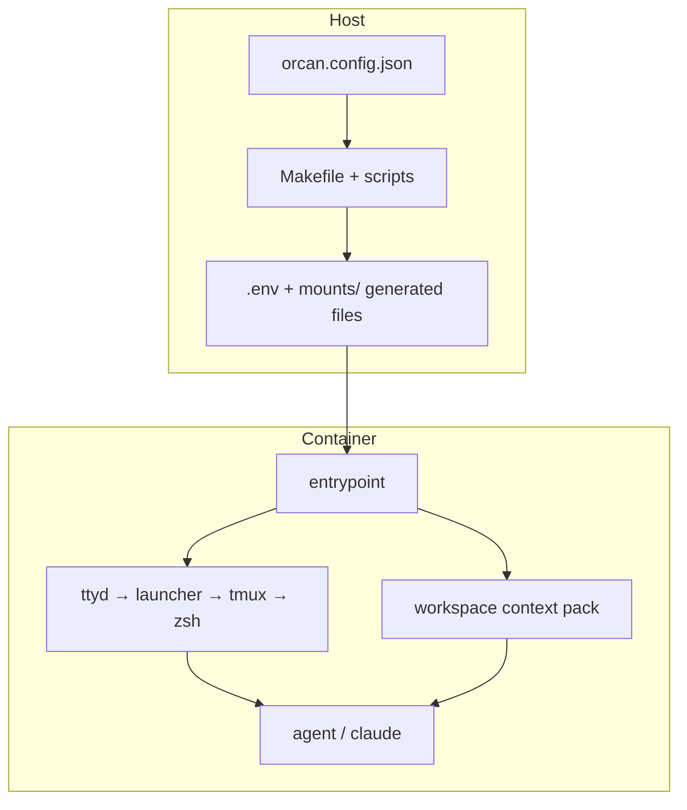
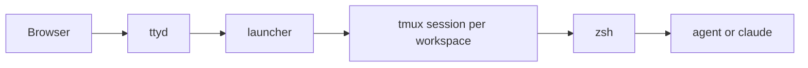

# Architecture

This page explains **why** the pieces exist. For Make targets and Compose file names, see [Reference](reference/makefile.md).

## Design problem

Orcan must:

1. Describe multi-repo **context** on the host (JSON config).
2. Run agents in an isolated **container** with heavy toolchains.
3. Keep **absolute paths** identical when the host Docker daemon resolves binds.
4. Give humans and agents a clear **entry** (browser → session → shell).

Those constraints force a split between **host orchestration** and **container runtime**.

## Layers

**Caption:** The host turns config into mounts and env. The container turns that into a session and agent-readable files. Models stay inside each CLI.

### Why the host owns config

Config must run without the image (wizard, CI host tests, `orcan sync`). Stdlib JSON keeps the host side thin. Compose YAML remains for Docker only.

### Why the image owns the toolchain

Cursor CLI, Claude Code, language toolchains, and shell defaults are large and shared. Baking them into the image avoids polluting every developer laptop — while project **source** stays on the host via mounts.

## Path parity and workspace links

Two mechanisms, one reason:

| Mechanism | Why |
| --- | --- |
| Bind mount `host_abs:host_abs` | Host Docker daemon needs real host paths |
| Symlinks under `/home/developer/workspaces/<name>/` | Short names for navigation and agent instructions |

See [Mental Model](ideas/mental-model.md) and [Path parity](concepts/path-parity.md).

## Entry path

**Caption:** The launcher is where you pick a workspace. tmux keeps one session per workspace so context switches are explicit.

Why not a plain SSH shell only? The browser path is the default product surface: one URL, one launcher, predictable tmux layout. Why not skip tmux? Multiple panes/windows are how people juggle projects inside one context; Orcan standardises that instead of inventing a new multiplexer.

## Context pack vs project seeds

At the **workspace root**, Orcan maintains a small pack (manifest, shared `AGENTS.md` / `CLAUDE.md`, ignores). That answers: “what is this context?”

Mounted **git checkouts** are not rewritten on every start. Seeding files into each `projects[].path` is explicit (`orcan seed --all`). That protects customer repos from surprise diffs while still allowing shared context above them.

## Product boundary

| Orcan owns | Orcan does not own |
| --- | --- |
| Workspaces, mounts, path parity | Which model a CLI uses |
| Context pack | Prompt engineering for a model |
| Entry path (ttyd → launcher → tmux → zsh) | Auto-routing between CLIs |
| Docker isolation and optional host socket | Shared RAG outside workspace files |

## Non-goals (by design)

- UI or flags to pick / pin models  
- An `AgentProvider` abstraction over `agent` / `claude`  
- Auto-routing prompts between CLIs  
- A task queue (brief → CLI → result bus)

## Where code lives

| Concern | Location |
| --- | --- |
| Host orchestration | `Makefile`, `scripts/repository/`, Compose files |
| Container filesystem | `docker/rootfs/` |
| Image build | `Dockerfile` |
| Global Cursor defaults (seeded missing-only) | `docker/rootfs/opt/cursor-defaults/` |
| This repo’s Cursor rules | `.cursor/rules/` |

## Next

- [Core Ideas](ideas/core-ideas.md)  
- [Typical workflows](guides/workflows.md)  
- [Host and container interface](interface.md)
