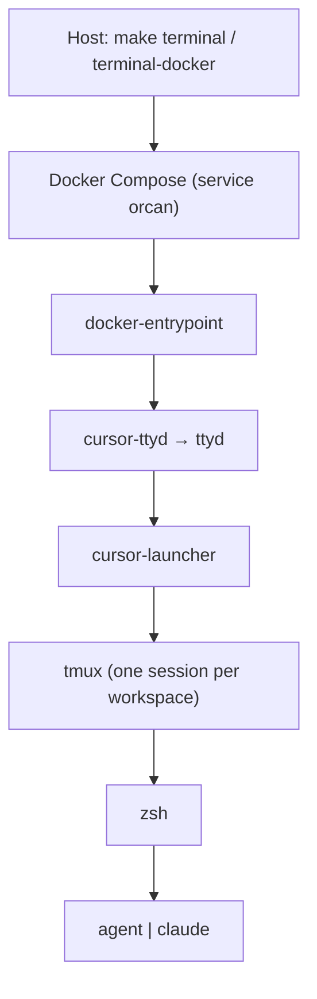

# Architecture

## What Orcan is

**Orcan** is an **environment and context orchestrator**. It decides *where* you work and *what* coding agents can see.

Cursor CLI (`agent`) and Claude Code (`claude`) are tools inside that environment. **Models are out of scope** for Orcan config — each CLI chooses its own model.

## Product boundary

| Orcan owns | Orcan does not own |
| --- | --- |
| Workspaces, mounts, path parity | Which model a CLI uses |
| Context pack (ignores, `AGENTS.md` / `CLAUDE.md`) | Prompt engineering for a model |
| Entry path (ttyd → launcher → tmux → zsh) | Auto-routing between CLIs |
| Docker isolation and optional host socket | Shared RAG / memory outside workspace files |

```text
orcan.config.json  →  mounts + workspace roots
                   →  context pack
                   →  tmux / launcher
                   →  agent | claude   (their models stay theirs)
```

## Runtime stack



## Context unit = workspace

A **workspace** is one root, one tmux session, and one or more project checkouts. See [Workspaces](workspaces.md).

### Context pack

`init-workspace` maintains files at the workspace root:

| File | Role | Update policy |
| --- | --- | --- |
| `.manifest.json` | Paths and symlinks | Every start |
| `AGENTS.md` / `CLAUDE.md` | Shared agent instructions | Every start |
| `.cursorignore` / `.cursorindexingignore` / `.claudeignore` | Discovery exclusions | Missing-only |
| `.claude/settings.json` | Deny rules for secrets | Missing-only |
| `.orcan/session-brief.md` | Optional handoff | On demand (`orcan-session-brief`) |

Agents should read: **`AGENTS.md` → `.manifest.json` → optional session brief → project files**.

Orcan does **not** auto-modify mounted git checkouts on every start. Use `make init-project-all` when you want seeds in each `projects[].path`.

## Host vs image

| Concern | Location |
| --- | --- |
| Host orchestration | `Makefile`, `scripts/repository/`, Compose files |
| Container filesystem | `docker/rootfs/` |
| Image build | `Dockerfile` |
| Global Cursor defaults (seeded at runtime) | `docker/rootfs/opt/cursor-defaults/` |
| This repo’s Cursor rules | `.cursor/rules/` |

## Non-goals

Do not add to Orcan:

- UI or flags to pick / pin models
- An `AgentProvider` abstraction over `agent` / `claude`
- Auto-routing prompts between CLIs
- A task queue (brief → CLI → result bus)
