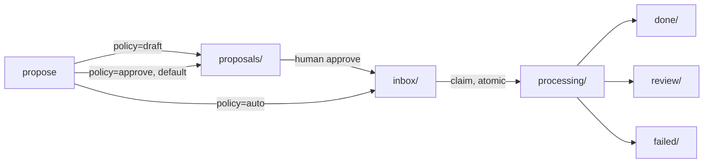

# Agent inbox

The **agent inbox** is a filesystem queue under `<workspace_root>/.orcan/tasks/` that
hands a small, structured **task manifest** from a discussion/planning agent to an
execution agent. It never hands over the discussion agent's own transcript.

## The problem it solves

A planning conversation in one agent session often ends with "now go implement
this." The easiest way to hand that off is pasting the whole transcript into
another session — but that burns context on back-and-forth that was never a
decision, and it gives the execution agent no way to tell "we settled this" from
"we were still arguing about this."

## How it works



- **`draft`** — stays in `proposals/` only; nothing ever picks it up.
- **`approve`** (default) — sits in `proposals/` until a human runs `approve`.
- **`auto`** — written straight to `inbox/`, claimable immediately.

`orcan-inbox` (in-container CLI) covers the whole lifecycle:

```bash
orcan-inbox propose --title "Add retry to fetch()" \
  --goal "Network calls should retry once on timeout" \
  --file src/fetch.ts --acceptance "Existing tests still pass"
orcan-inbox approve task-abc123
orcan-inbox watch --executor claude   # claim + run one task at a time
```

`claim` is an atomic rename (`inbox/<id>.json` → `processing/<id>.json`), so two
workers racing for the same task never both get it — the loser just gets an
`OSError` and moves on. An **executor** then turns the manifest into a prompt
(`build_prompt()` renders only the known fields: goal, context, decisions,
constraints, files, acceptance, risks — an arbitrary `transcript` field on the
task is silently dropped, not leaked into the prompt) and runs it — `claude -p`,
`codex exec`, or a plain shell command, depending on `execution.executor`.

## Trade-offs

## Next
