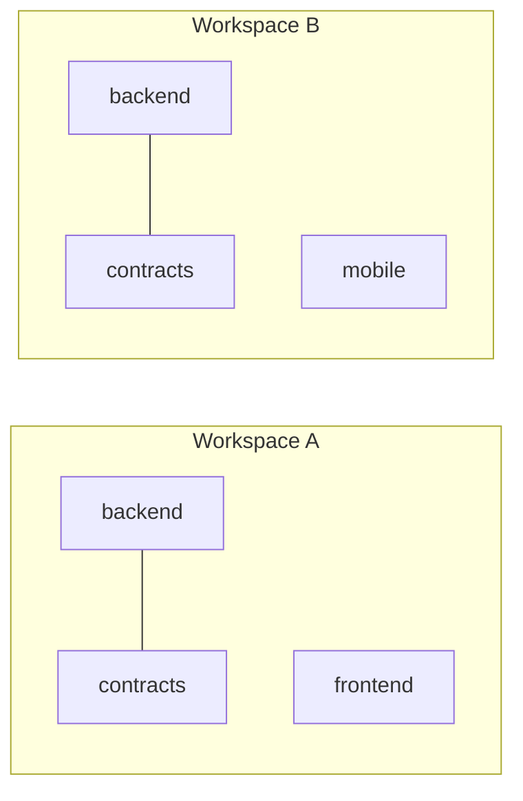
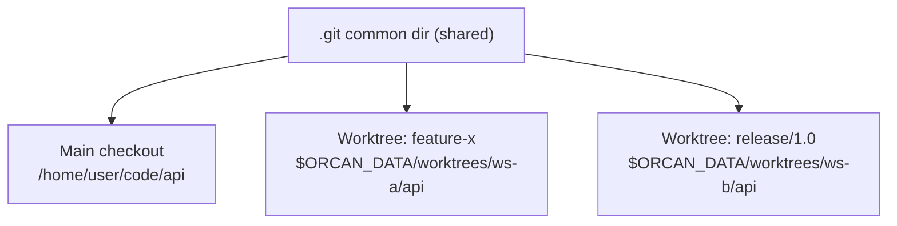
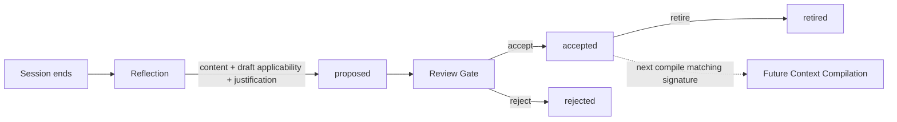

# Context Assertions

A **Context Assertion** is a small, human-approved statement — a rule, fact, hint, or policy — that the Context Compiler *may* include in a workspace's Context Pack, but only when it applies **right now**. Orcan stays a Context Manager: this is one more source the Compiler reads, not a memory system, not a knowledge base, not RAG.

## The problem it solves

The same repositories can mean different things in different workspaces:



`backend` and `contracts` are the same two checkouts in both workspaces — but the decisions, constraints, and procedures that hold in Workspace A are not guaranteed to hold in Workspace B. A model that files a note under "the `contracts` project" and hands it to every workspace that happens to mount `contracts` would be wrong half the time.

Context Assertions fix this by separating two things that look similar but are not:

- **Where a statement is filed** — its *anchor*, a project path, purely organisational (where the record physically lives, versioned with the rest of the store).
- **When a statement applies** — its *applicability*, a predicate evaluated fresh for every workspace, every time.

Filing location never decides applicability. Only the predicate does.

## Applicability, not scope

A single `scope` field cannot express "applies to workspace A" and "applies whenever `backend` and `contracts` are mounted together, regardless of workspace name" at the same time — real conditions need composing. Applicability is a small predicate built from atoms, combined as *AND across atom types, OR within an atom's list*:

| Atom | Answers |
| --- | --- |
| `workspace` | Is the workspace named one of these? |
| `repo_set_all_of` / `any_of` / `none_of` | Are these projects present / absent, together? |
| `branch` | Does a qualifying project's branch match one of these globs? |
| `valid_from` / `valid_until` | Are we inside this date window? |

No predicate at all means "applies wherever this assertion's anchor project is mounted" — the common case needs no configuration.

One honest limitation: only signals knowable **before** the agent starts (workspace name, mounted repos, branch) can gate an assertion in v1. What the agent will actually touch is only known *during* a session, so path-based applicability is out of scope until there is a declared-intent input to evaluate it against.

## Identity: what counts as "the same project"?

The anchor is a project, but a project is not the same thing as a filesystem path. `orcan context worktree create` checks out a branch of a repo at its **own** path (under `$ORCAN_DATA/worktrees/<workspace>/<project>/`) — a different directory from the main checkout, even though it is unmistakably the same repository.

If the store keyed identity on the working-copy path, a branch worktree would silently get an empty store, disconnected from everything already accepted about that repo — the same anchor-vs-scope mistake this whole design exists to avoid, just one level down.

Instead, identity is keyed on the repo's git **common dir** (`git rev-parse --git-common-dir`) — the object database every worktree of a repo shares, regardless of where each one happens to be checked out:



All three resolve to the **same** `project_id`, hence the same store — the branch you happen to be on is not a different project, it's a different value of the `branch` atom in the Context Signature (see the table above). Write a release-only assertion once, anchored at whichever checkout is convenient, and it applies correctly everywhere that repo's identity shows up, gated by branch. A directory that isn't a git repo at all falls back to identity-by-path — stable, just not worktree-aware (Orcan projects are expected to be git repos anyway).

## Lifecycle



Nothing reaches `accepted` automatically. A human review is required, and it is also where a too-broad or too-narrow draft predicate usually gets corrected — the reviewer, not the proposer, is best placed to know whether something is really workspace-specific or genuinely structural.

## Drafting and reviewing without leaving the session

`orcan context assert propose|accept|reject|retire` (host CLI) is the ground truth, but typing full commands in a separate host terminal is real friction for something you want to do the moment you notice it, mid-conversation with an agent. Two in-container tools remove that friction *without* moving the accept decision anywhere but a human:

- **`orcan-context-propose`** — callable by you or by the agent, right in the same tmux session. It never touches `$ORCAN_DATA/context` (still not mounted into the container); it drops a small JSON file into `<workspace_root>/.orcan/context-inbox/`. Run interactively, it asks immediately — *"Save this? [y]es / [e]dit scope / [n]o"* — and stamps your answer onto the drop file. Run non-interactively (e.g. by an automated post-task reflection step), it just queues the candidate with no decision yet. It also has a second mode for existing assertions: `--flag-existing ID --reason TEXT` marks an already-`accepted` assertion for a second look, without touching the store — it never mutates anything itself.
- **`orcan-context-review`** — candidates come from two merged sources. (1) Undecided drops still sitting in `<workspace_root>/.orcan/context-inbox/` — read directly, **no prior `orcan sync` needed**, since a propose drop already carries its full content; `[y]es/[n]o` rewrites that same drop's `"decision"` field in place (exactly what interactive `orcan-context-propose` already does by hand), so a single following `orcan sync` does propose *and* apply in one pass. (2) A host-generated `context-review-queue.json` (never the raw store) — items already imported into the store as `proposed` (either from a previous sync that weren't decided yet, or proposed straight from the host, bypassing the inbox entirely); `[y]es/[n]o` on these writes a decision file into `<workspace_root>/.orcan/context-decisions/`, applied at the *next* sync, same as before. The queue also carries `reconsider` — already-`accepted` assertions someone flagged for a second look — which can *only* come from the queue, since a flag drop carries no content, only an id + reason; the real text lives solely in the host-only store. Reconsider items get `[k]eep / [r]etire / [s]kip` — "keep" never mutates the store, it just clears the flag.

**Duplicate/conflict pre-check (in-container, best-effort).** Before showing `candidates` (not `reconsider` — those were already decided once), `orcan-context-review` runs one batched `claude -p --model haiku` call comparing every pending candidate against `<workspace_root>/CONTEXT-ASSERTIONS.md` — the same compiled file `orcan-context-reflect` already reads. This runs entirely in-container, never the host: `claude` is only guaranteed present there (the Dockerfile installs it), while host-side scripts (`scripts/repository/*.py`) are deliberately stdlib-only and cannot assume a Claude Code install exists on whatever machine `orcan` itself runs on. A candidate the model flags gets one extra line above its details — `⚠ possibly duplicates existing: "..."` or `⚠ may conflict with existing: "..."` — before the same `[y]es/[n]o/[s]kip` prompt as always. It is a nudge, not a gate: nothing is skipped, blocked, or auto-decided, and the check is disabled with `--no-check` or silently skipped (never blocks review) if `claude` is missing, the call fails or times out, or `CONTEXT-ASSERTIONS.md` doesn't exist yet. Coverage caveat: it only sees assertions whose applicability predicate currently matches *this* workspace — since assertions are anchored by project identity, not workspace (see `project_id` above), and applicability defaults to unrestricted, reopening a project in a different workspace already compiles its prior facts back in, so this is a non-issue for the common case.

**Consolidation offer.** The pre-check's single model call also drafts a merged replacement for anything it flags `duplicate`/`conflict` (`consolidated_title`/`consolidated_content` in its JSON response — no second call). If you then accept that candidate, `orcan-context-review` asks one more question: queue the drafted consolidation and flag the overlapping existing item for retirement? A "yes" just runs `orcan-context-propose` twice more — a normal `--queue` proposal for the merged text (`--source consolidation`) and a `--flag-existing` on the old item — exactly the same drops as manual/reflection-sourced ones, reviewed next cycle like everything else. Nothing merges or retires immediately; this only ever queues *more* work for the next review round, never bypasses it. This is how the store stays a coherent, de-duplicated body of knowledge rather than a growing linear log — consolidation happens at the moment you'd otherwise have accepted a near-duplicate anyway.

Both directions are one-way drops into a mounted inbox — there is no live channel back to the host. `orcan sync` (`compile_context.py`) is what actually turns a drop into a real, git-versioned `propose()`/`accept()`/`reject()`/`retire()` call the next time it runs. In practice this means a decision you make feels instant in the conversation, but only takes effect in the store — and therefore in a future `CONTEXT-ASSERTIONS.md` — at the next sync. This asymmetry is intentional: it is the same boundary that keeps the agent from ever writing to the store directly, just made convenient enough that reviewing candidates costs one keystroke instead of a context switch.

## Batched, automated Reflection

Reflection does not have to be triggered by a human noticing something — but firing a model call after *every single turn* is both wasteful and noisy. `orcan-context-reflect` batches instead: it is wired as a Claude Code `Stop` hook that is **on by default** — `orcan sync` (`apply-config.py`) seeds it into that **workspace's generated root** `.claude/settings.json` the first time a workspace is synced (a merge, not an overwrite). Opting out is what's configurable: `orcan context hook disable [WORKSPACE ...] [--all]` (host) removes it, and because sync only ever seeds a workspace whose `.claude/settings.json` doesn't exist yet, that choice sticks across every later sync — `orcan context hook enable`/`status` check/restore it the same way. It lives at the workspace root — not inside any project checkout — because that is where Claude Code sessions actually launch (tmux windows always start there; see `cursor-tmux-workspace-attach`) and therefore the only place a `Stop` hook can be loaded from. The hook fires after every completed turn, but does almost nothing on most of them:

**Deliberately Claude-only.** Cursor CLI has its own hooks system (1.7+, `~/.cursor/hooks.json`, a `stop` event), but in headless/CLI mode — how Orcan runs it, not the full IDE — its event coverage is unreliable as of this writing, and `orcan-context-reflect` already reads a Claude-Code-specific hook payload and transcript format; wiring Cursor in would need a separate adapter, not just config. Instead Cursor benefits **passively**: `init-workspace` generates `AGENTS.md` (Cursor) and `CLAUDE.md` (Claude) with identical content, so once an accepted assertion lands in the compiled `CONTEXT-ASSERTIONS.md` at the next `orcan sync`, Cursor sees it in that same `AGENTS.md` even though it never drives Reflection itself.

- A per-`session_id` counter and transcript-line offset live in `<workspace_root>/.orcan/reflection-state.json`. Tracking is keyed by session id because a line offset from one session's transcript is meaningless for another's.
- Below the threshold (default 20 completed turns), the hook just increments the counter and exits — no model call, near-zero cost.
- At the threshold, it resets the counter, reads only the *new* transcript lines since last time, reads the workspace's current `CONTEXT-ASSERTIONS.md` (exactly what the agent itself already sees — no separate host round-trip needed), and asks a lightweight model (`claude -p --model haiku` by default) to return a small JSON action list: `propose` for new candidates, `flag_existing` for assertions that now look stale. Each action is dispatched through the *same* `orcan-context-propose` used for manual drafting — always `--queue`, never a decision attached, so a human still reviews it.
- A manual escape hatch always works too: run `orcan-context-reflect --force` (feeding it the same session id/transcript path/cwd) to reflect immediately regardless of the counter — useful since a session that ends before reaching the threshold would otherwise never trigger one automatically.
- A `propose` action drafted while the project is checked out on anything but `main`/`master` is scoped to that branch by default (`--branch <current>` added to the dispatch to `orcan-context-propose`) — Reflection runs mid-work and cannot yet know whether something is durably true or just an artifact of unmerged, in-progress code, so the safer default is narrow; a human reviewer widens it at accept time if it turns out to be universal.
- A failed model call (timeout, non-zero exit) is recorded — message + timestamp — into the same per-session `reflection-state.json`, and cleared on the next successful run, instead of only reaching an async hook's stderr that nothing reads. `orcan doctor` surfaces the last recorded failure per workspace, so a hook that's enabled but silently failing every time doesn't look identical to a healthy one.

The threshold check happens entirely before any model is invoked, so most `Stop` events cost a few milliseconds of file I/O and nothing else. And — worth repeating, because it's the one rule this entire design does not bend on — the reflection pass can *propose* and can *flag*, but it can never accept, reject, or retire anything itself.

This also means an **automated Reflection step is fully compatible with the model**: something running after each task can compare the session against the existing accepted assertions, decide what's genuinely new, and call `orcan-context-propose --queue` for anything worth surfacing — with zero manual effort up to that point. The one thing it must never do is attach a decision itself; only a human answering `orcan-context-review` (or the interactive propose prompt) can turn a candidate into standing truth. Removing that one checkpoint reopens exactly the failure mode this whole design exists to prevent: a session's misunderstanding compiling into the *next* session's "established fact", with no corrective step in between.

## Compilation: an artifact, not a document

`orcan sync` runs the **Applicability Layer** for every enabled workspace: it builds a **Context Signature** (workspace name, the repos actually mounted, each repo's current branch) and matches it against every `accepted` assertion anchored to a project in that workspace. Matches are rendered into `CONTEXT-ASSERTIONS.md` at the workspace root — visible to `AGENTS.md` / `CLAUDE.md` alongside the rest of the context pack — headed by a **Workspace composition** section (every mounted project and its current branch) so the signature that drove matching is visible, not just implied. The file is written whenever the workspace has at least one project, even with zero matches (it says so explicitly); only a workspace with no projects at all gets no file. `orcan context assert overview` prints the same composition plus a per-workspace match count in one line each, across every configured workspace at once — useful when several workspaces share a project under different mixes.

Every rendered item carries two distinct justifications:

- **Problem it solves** — the author's reason the assertion exists at all.
- **Selected because** — the mechanical reason it matched *this* signature (e.g. `workspace=customer-a`).

If the Compiler cannot state both, the item does not belong in the pack. This is why a Context Pack is a compiled artifact with a paper trail, not a growing pile of notes — and why there is a hard cap on how many assertions one compilation includes, forcing prioritisation instead of accumulation.

## No database — plain files, versioned by git

There is no SQLite, no vector store, no server. Each project anchor is one directory:

```
$ORCAN_DATA/context/<project-id>/
├── .git/            ← history = version history (every change is a commit)
├── index.json        ← flat index (id → title/status/kind/dates) for fast list/select
└── objects/
    ├── <id-1>.json    ← one full Context Assertion record
    └── <id-2>.json
```

That is the entire "database". It is a deliberate MVP constraint, not a placeholder for one: files + git + a simple index, so the whole mechanism stays inspectable with `cat` and `git log`, and any future storage upgrade is an implementation detail behind the same functions, not a redesign.

## What this deliberately does not do

- No embeddings, vector search, or LLM ranking — matching is a handful of mechanical predicate checks.
- No automatic acceptance — proposing (even from an automated batched Reflection pass) never implies applying; only a human decision, interactive or queued, can turn a candidate into `accepted`, keep something, or retire it.
- No live recompilation — drafting and deciding can happen inline, in-session, but the Applicability Layer and the Context Pack it produces only ever refresh at the next `orcan sync`; a running session cannot trigger one.
- No automated conflict resolution between assertions — v1 relies on every matched item being rendered together, visibly, for a human or agent to notice contradictions.
- No autonomous retirement — the automated Reflection pass can *flag* an assertion as possibly stale, but retiring it is always a human's `[r]etire` in `orcan-context-review`, never automatic.

## Status: implemented vs. proposed

**Implemented (RFC-0001) — in code today:**

- The Context Assertion record: content, `kind` (presentational only: rule/fact/hint/policy/…), `justification`, `applicability` predicate, lifecycle status.
- The store: `scripts/repository/context_assertions.py` — propose / accept / reject / retire, git-versioned per anchor under `$ORCAN_DATA/context/<project-id>/`.
- Identity keyed on git common-dir, so a repo's main checkout and its worktrees share one store (see "Identity" above).
- The Applicability Layer: `select_for_workspace()` — matches `workspace` / `repo_set_*` / `branch` / `valid_from`-`valid_until` against a Context Signature built from `runtime-config.json` + `git branch --show-current`.
- The Compiler hook: `scripts/repository/compile_context.py`, run by `orcan sync`, renders `CONTEXT-ASSERTIONS.md` at the workspace root; `docker/rootfs/usr/local/bin/init-workspace` surfaces it from the generated `AGENTS.md`/`CLAUDE.md` when present. Every render is headed by a **Workspace composition** section (repo@branch) and is written whenever the workspace has ≥1 project, not only when something matched.
- CLI: `orcan context assert propose|list|show|accept|reject|retire|select|overview|root` (host) — `overview` prints composition + accepted-assertion count for every configured workspace, recomputed live, one line each.
- In-container inbox: `orcan-context-propose` / `orcan-context-review` drop JSON files into `<workspace_root>/.orcan/context-inbox/` and `context-decisions/`; `compile_context.py` imports them (with quarantine for anything malformed or unresolvable) and regenerates `context-review-queue.json` on every `orcan sync`, before compiling. See "Drafting and reviewing without leaving the session" above.
- Reconsideration: `orcan-context-propose --flag-existing ID --reason TEXT` marks an already-`accepted` assertion for a second look, tracked in `<workspace_root>/.orcan/context-flags/`; `orcan-context-review` offers `[k]eep`/`[r]etire` for it.
- Batched automated Reflection: `orcan-context-reflect`, a `Stop` hook — **on by default** — that batches by a per-session turn counter (default 20) before calling a lightweight model and dispatching through the same propose tool. Seeded on the first `orcan sync` for a workspace; opt out (and it sticks) via `orcan context hook disable|enable|status [WORKSPACE ...] [--all]` (`scripts/repository/claude_hook.py`) — merges/removes it in the workspace's generated root `.claude/settings.json` (resolved by name via `workspaces/index.json`), immediately. A `propose` drafted on a non-main/master branch is scoped to it by default, and model-call failures are recorded per session and surfaced via `orcan doctor`. See "Batched, automated Reflection" above.

**Implemented (RFC-0002 — extending the record, not a new subsystem):**

The question behind RFC-0002 was whether Orcan needs a separate, self-deepening "understanding" system on top of RFC-0001. Verdict: no — that would require the system itself to interpret and infer, which is exactly the reasoning Orcan must not do. The accepted direction was a small, disciplined *extension* of the existing Context Assertion record — now implemented:

- **Typed relationships** — `relations: [{type, target_id, target_project}]` on the record (`normalize_relations()` in `context_assertions.py`), a closed, small vocabulary: `depends_on`, `risk_of`, `supersedes`, `conflicts_with`. Free-text "related to" was explicitly rejected — an open vocabulary is just notes again. A relation always lives on the *source* assertion and is validated against an existing target at propose/accept time; it never mutates the target.
- **Epistemic status** — `epistemic_status: fact | interpretation | hypothesis | conclusion` (default `fact`), set at propose time and correctable only by a human at Review (`accept(..., edited_epistemic_status=...)`), never inferred authoritatively by the system. "Understanding" itself is still not a stored level — it's what a human (or agent) does when reading a well-labelled, related set of these; the store's job is only to make that easy.
- **`criticality`** — `normal` | `high`, same pattern: proposed, human-correctable at accept time.
- **Bounded 1-hop traversal** — `select_for_workspace()` pulls in an `accepted` relation target after normal applicability matching, but only when the target's own project is mounted in *this* workspace, only if not already selected, and never past the same overall `limit`. No recursion — a target's own relations are never followed a second hop.
- Reflection can draft all of this too: the model may suggest `epistemic_status`, `criticality`, and `relations` on a `propose` action — always referencing an id already visible in the current `CONTEXT-ASSERTIONS.md`, always within the same project (automated Reflection never guesses at another project's name; cross-project relations still work from the interactive/host paths, where a project name is given explicitly). A human still corrects or accepts every field before it's `accepted`.

None of this needed a new store, a new CLI surface, or a new file location — it's additional fields on the same records, in the same files, surfaced through the same propose/review flow.

## Next

- [CLI reference](../reference/cli.md) — `orcan context assert propose|list|show|accept|reject|retire|select`
- [Core Ideas](core-ideas.md) — Project, Workspace, Context
- [Mental Model](mental-model.md)
