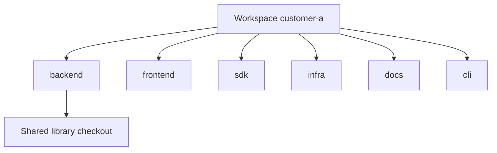

# Core Ideas

Three words carry most of Orcan. Learn them before any Make target.

## Project

A **project** is one repository checkout on disk: an absolute path you already clone with Git.

It is not “the company”, not “the product”, and not the whole job. It is one code tree with its own history and remotes.

Why call it out? Because agents and humans often blur “the work” with “this folder”. In Orcan, the folder is a **project**. The work spanning several folders is something else.

## Workspace

A **workspace** is a **named set of projects** that belong together for a stretch of work.

It groups:

- which checkouts sit side by side
- one place for shared agent-facing files (the context pack)
- one interactive session (tmux) so “switch customer” means switch workspace

A workspace is more important than a single project when you use coding agents: the agent needs the **bundle**, not only the app repo.

Without workspaces, you keep reinventing “these six paths are customer A”.

## Context

**Context** is what you and the agents can see and rely on for that workspace:

- the mounted trees (same absolute paths as the host — path parity)
- short navigational links under a workspace root
- shared instructions and ignores (`AGENTS.md`, `CLAUDE.md`, ignore files)
- optional handoff notes

Context is not a vector database and not a model prompt library. It is the **reproducible working environment** around several projects.

### Example: Customer A

Imagine one workspace named `customer-a`:

| Project symlink | Checkout (absolute path) | Typical org |
| --- | --- | --- |
| `backend` | `/home/you/code/acme-api` | Acme API team |
| `frontend` | `/home/you/code/acme-web` | Acme Web |
| `sdk` | `/home/you/code/partner-sdk` | Partner |
| `infra` | `/home/you/code/acme-infra` | Platform |
| `docs` | `/home/you/code/acme-handbook` | Docs |
| `cli` | `/home/you/code/acme-cli` | Tools |

Six remotes. Six histories. **One context.**



The diagram is about **membership**, not Git remotes. The workspace does not “contain” the commits; it **names the set** you work in together.

### Example: Orcan itself

A tiny workspace might mount only the Orcan repo — useful when you develop the orchestrator. Same ideas: one project path, one workspace name, one context pack.

## How the ideas connect

```text
Context (what you work inside)
    └── Workspace (named bundle + session)
            ├── Project (repo path)
            ├── Project
            └── Project
```

Git manages each project. Orcan manages how they form a context.

## Next

- [Mental Model](mental-model.md) — relations and config shape  
- [Workspaces (deep dive)](../concepts/workspaces.md)  
- [Why Orcan?](../why-orcan.md)
