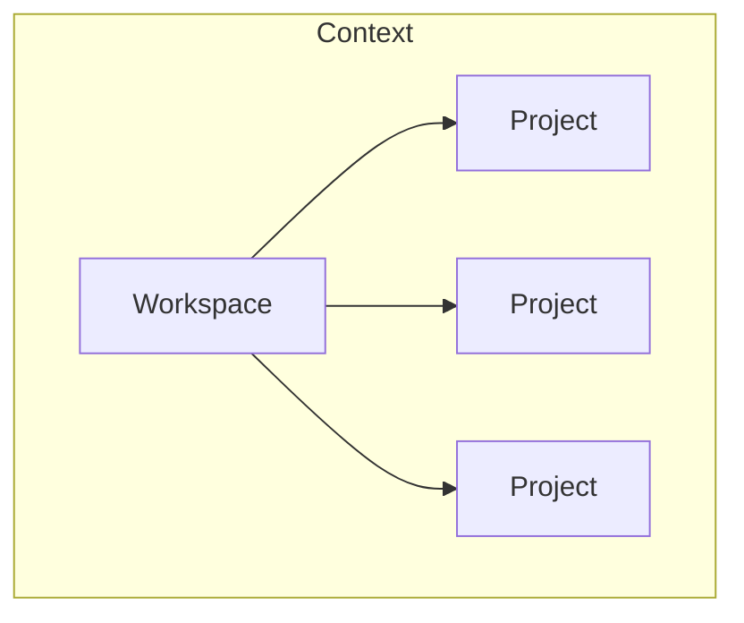
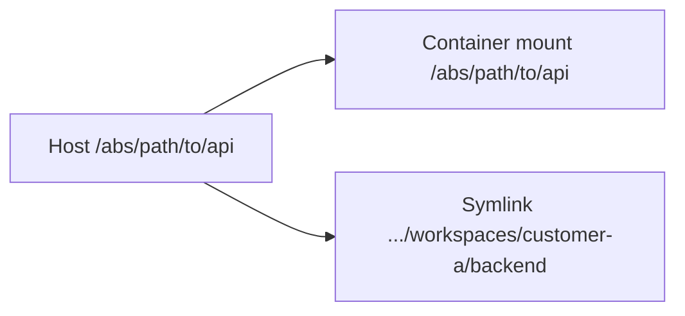
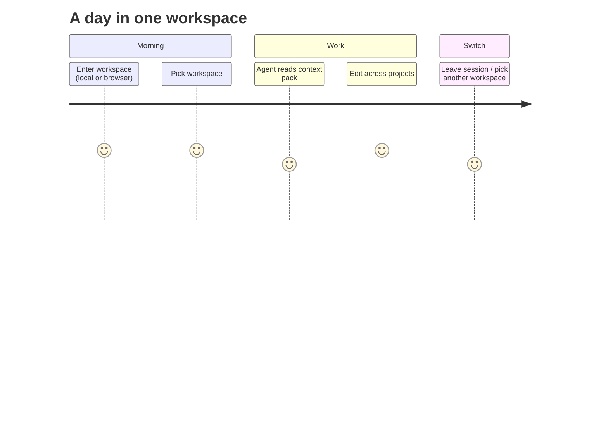

# Mental Model

Hold this picture before you touch JSON or Make.

## The tree

```text
Workspace
    │
    ├── Project
    ├── Project
    ├── Project
    └── Project
```



**Caption:** A workspace sits inside a context. Projects hang off the workspace as members, not as nested git remotes.

## Three sentences

1. A **workspace** does not hold your source history. It describes **which projects belong together** and how you enter that set (session, starter files).
2. A **project** does not describe the business. It describes **one repository path** on disk.
3. **Context** describes the **environment of work**: mounts, shared instructions, ignores, and the terminal entry path.

## What you configure

After the ideas are clear, the host file is only a description of the tree:

```json
{
  "workspaces": [
    {
      "name": "customer-a",
      "projects": [
        { "name": "backend", "path": "/absolute/path/to/acme-api" },
        { "name": "frontend", "path": "/absolute/path/to/acme-web" },
        { "name": "sdk", "path": "/absolute/path/to/partner-sdk" }
      ]
    }
  ]
}
```

- `workspaces[].name` — workspace identity (and tmux session name).
- `projects[].name` — short name inside the workspace (symlink).
- `projects[].path` — absolute host path (same path inside the container).

Full field list: [Configuration guide](../getting-started/configuration.md).

## Two ways to see the same projects

Orcan exposes each project in two complementary ways:

| View | Role |
| --- | --- |
| Symlink under `/home/developer/workspaces/<name>/` | Human and agent navigation (“cd backend”) |
| Bind mount at the **same absolute path** as the host | Path parity for Docker-from-Docker |

That is not duplication for its own sake. Nested Compose on the **host** daemon only understands host paths. Symlinks alone would lie to Docker. Absolute mounts alone would be awkward to browse. You get both.



**Caption:** Same checkout, two access paths — parity for Docker, short names for people and agents.

## Day journey (mental, not commands)



**Caption:** The unit of “where am I working?” is the workspace, not a single `cd` into one repo.

## Path parity as a consequence

Path parity is not a random feature. It follows from “agents may run Docker against the host daemon.” See [Path parity](../concepts/path-parity.md).

## Sandbox as the stable anchor

Managed project checkouts and Orcan worktrees live under
`$ORCAN_PROJECTS_ROOT` (default `~/.config/orcan/sandbox`). That directory is
**one always-mounted bind** in Compose.

| Piece | Role |
| --- | --- |
| `sandbox/<project>/` | Managed clones “parked” under one root |
| `sandbox/.worktrees/<workspace>/<project>/` | Managed branch checkouts (leading dot = not a live project listing) |
| Projects outside sandbox | Still path-parity binds — usually need recreate when the mount list changes |

**Tradeoff:** everything under the sandbox is visible in the running container.
That is the price of adding or removing a managed checkout with `orcan sync`
alone (no `orcan down && orcan up`). See [Workspaces](../concepts/workspaces.md)
and [Security](../reference/security.md). For how `orcan sync` actually makes
that change take effect in a running container, see
[Runtime reconcile](runtime-reconcile.md).

## Cross-workspace visibility (by design)

`$ORCAN_HOME/workspaces/` is mounted once as `/home/developer/workspaces/`.
Each workspace is a subdirectory (symlinks, `AGENTS.md`,
`CONTEXT-ASSERTIONS.md`, `.orcan/context-inbox/`, …).

**Tradeoff:** an agent started in workspace A can also see workspace B’s tree.
That is intentional — it lets you add, remove, and switch workspaces without
growing a per-workspace bind list and recreating the container. Orcan is
single-user on one host, not a multi-tenant isolator. Isolation between
workspaces is organisational (which session you attach to), not a hard
security boundary.

## Next

- [Architecture](../architecture.md) — why the layers look like this  
- [Security](../reference/security.md) — capability ladder and mount tradeoffs  
- [Quick Start](../getting-started/quickstart.md)  
- [Typical workflows](../guides/workflows.md)
