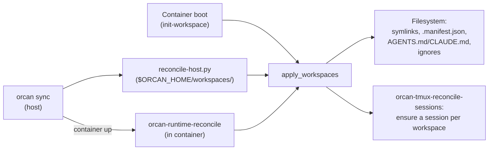

# Runtime reconcile

Adding a project to a workspace, or dropping one, used to mean `orcan down &&
orcan up` — a fresh container, a fresh tmux server, and whatever an agent was
in the middle of doing, gone. **Runtime reconcile** is the mechanism that
makes `orcan sync` alone enough for the common case.

## The problem it solves

A container recreate is not free. It kills every tmux session, so an agent
mid-task loses its shell state, its running process, and — if you weren't
watching — its work. Needing a recreate just to make a newly-added repo
visible is a bad trade for something that should be as cheap as editing a
config file.

## Two things stay stable so a recreate isn't needed

- **One managed-root bind mount.** Every project living under
  `$ORCAN_PROJECTS_ROOT` (default `sandbox/`) is already visible inside the
  container through a single, always-present mount — see
  [Mental Model](mental-model.md) ("Sandbox as the stable anchor"). Adding a
  project under that root never changes the Compose mount list.
- **One workspaces-parent bind mount.** `$ORCAN_HOME/workspaces/` is mounted
  once; a new workspace directory under it is visible immediately — see
  [Mental Model](mental-model.md) ("Cross-workspace visibility").

Reconcile is what turns "visible on disk" into "the right symlinks,
manifests, and tmux sessions exist."

## What reconcile actually does

The same function, `orcan.reconcile.apply_workspaces()`, runs at three call
sites:



Host reconcile runs on every `orcan sync` — even when the container is down —
so workspace symlinks under `$ORCAN_HOME/workspaces/` are fixed before you
`orcan up`. Live in-container reconcile is idempotent when the container is
already running.

Container boot is just the first in-container reconcile, not a separate code
path — that's why a live `orcan sync` and a fresh boot produce identical
on-disk state inside the container.

On the filesystem side: create missing project symlinks, remove orphaned
ones, (re)write `.manifest.json` / `AGENTS.md` / `CLAUDE.md` /
`README.workspace.md` — but only when content actually changed, so an
unchanged workspace costs no writes on a reconcile that finds nothing to do.

On the tmux side: ensure every configured workspace has a session (created
lazily, not attached). A session whose workspace disappeared from config is
**reported, never killed** by default — an active agent inside one must not
lose its session just because its workspace was renamed or removed.
`orcan sync --prune-orphans` opts into killing those (never the default).

`orcan-runtime-status` gives you the read-only diff — desired (config) vs.
actual (filesystem + tmux) — without reconciling anything, useful right
before or after a live change.

## Example

```bash
# Workspace "demo" is running; you add a second project to it.
orcan context add /absolute/path/to/another-repo --workspace demo
orcan sync
# container is running — reconciling live (no restart)
# live reconcile complete
```

The new project's symlink appears under
`/home/developer/workspaces/demo/` in the *running* container. Any tmux
session already open — including one with an agent mid-task — is untouched.

## Trade-offs

- **Only the two stable mounts skip a recreate.** A project outside
  `$ORCAN_PROJECTS_ROOT` still needs its own path-parity bind — adding one of
  those still needs `orcan down && orcan up`.
- **Orphan tmux cleanup is opt-in, on purpose.** Report-only by default
  costs you a `? session-name` line in `orcan-runtime-status` until you
  explicitly prune; the alternative (auto-kill) risks killing a session an
  agent is actively using.
- **Idempotent, not free.** A no-op reconcile still walks every configured
  workspace and diffs its four generated files against disk — cheap, but not
  literally zero cost on a very large config.

## Next

- [CLI reference](../reference/cli.md) — `orcan sync [--prune-orphans]`
- [Mental Model](mental-model.md) — why the sandbox and workspaces mounts are stable
- [Security](../reference/security.md) — mount layout trade-offs
