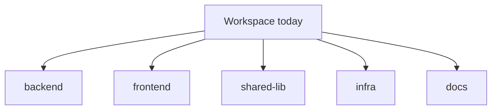

# Orcan

Orcan orchestrates **work context** for coding agents: which repositories belong together, how they are mounted, and how you enter that environment in Docker.

It does **not** choose models. Cursor CLI (`agent`) and Claude Code (`claude`) keep their own accounts and model settings.

## The problem

You maintain many repositories. They often come from different organisations. Some collaborate. Some pin versions of shared libraries. Each laptop accumulates a different mix of tools and startup habits.

After a few months, the expensive part is not `git clone`. It is **rebuilding the full context**: which checkouts form today’s job, what agents should read first, and which absolute paths still work when Docker runs inside Docker.

## The solution

Orcan does not manage products. It manages **context**.

- A **project** is one checkout (absolute path).
- A **workspace** is a named set of projects that belong together.
- **Context** is the reproducible environment around that set: mounts, shared instructions, ignores, and a browser terminal session.

Configuration describes those relationships. `orcan sync` and Docker apply them. Agents and humans then share the same layout.

## A day of work

You might touch, in one morning:

- backend API  
- frontend app  
- shared library  
- infrastructure repo  
- documentation  

Each is its own repository. Each may live under a different org. Together they are still **one job**. Orcan lets you name that job as a workspace and open it as one session.



**Caption:** One workspace, many projects — the unit of work is the set, not a single folder.

## How to read these docs

1. [Why Orcan?](why-orcan.md) — when it helps and when it does not  
2. [Core Ideas](ideas/core-ideas.md) — Project, Workspace, Context  
3. [Mental Model](ideas/mental-model.md) — how the pieces relate  
4. [Quick Start](getting-started/quickstart.md) — run it once you understand the idea  

Reference pages (CLI, env vars, Compose) come **after** that arc.

## Try it (after the idea)

```bash
git clone https://github.com/aKyther/orcan.git
cd orcan
orcan init /absolute/path/to/your/repo   # includes orcan sync once
orcan sync                                             # .env + mounts/* for Compose
orcan build
orcan up
```

Open `http://localhost:7681`, pick a workspace, then run `agent` or `claude`. Config changes always need `orcan sync` before recreate.

## Status

Version **0.4.2** (see [Changelog](changelog.md)). Distributed as a **CLI** (`orcan`). `orcan build` pulls the image for this version when available, otherwise builds locally. Publishing images is **manual** (`orcan publish`); CI does not publish container images.

## See also

- [Architecture](architecture.md)  
- [FAQ](faq.md)  
- [GitHub repository](https://github.com/aKyther/orcan)
