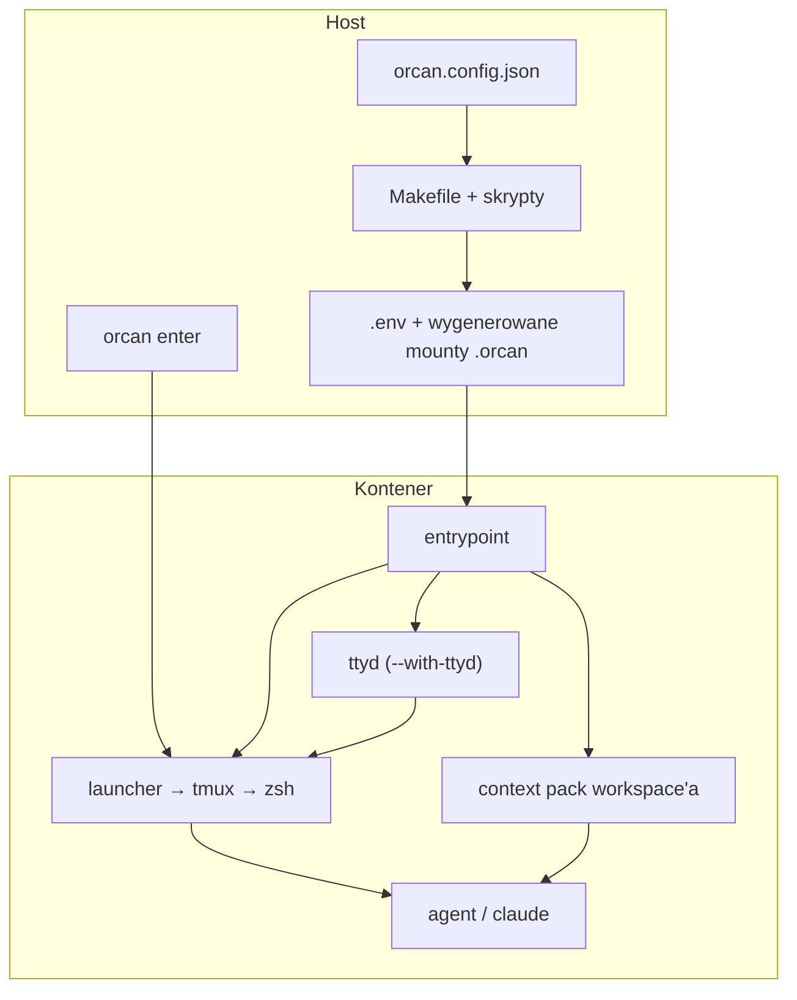
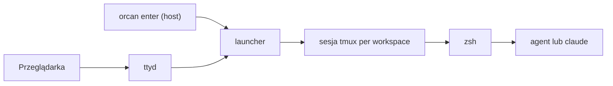

# Architektura

Ta strona wyjaśnia **dlaczego** elementy istnieją. Targety Make i nazwy plików Compose: [Referencja](reference/makefile.md).

## Problem projektowy

Orcan musi:

1. Opisać **kontekst** multi-repo na hoście (konfiguracja JSON).
2. Uruchamiać agentów w izolowanym **kontenerze** z ciężkimi toolchainami.
3. Utrzymać **identyczne ścieżki bezwzględne**, gdy daemon Dockera hosta rozwiązuje bindy.
4. Dać ludziom i agentom jasne **wejście** — lokalnie (`orcan enter`) albo opcjonalnie w przeglądarce (`orcan up --with-ttyd` → sesja → shell).

Te ograniczenia wymuszają podział na **orkiestrację hosta** i **runtime kontenera**.

## Warstwy

**Podpis:** Host zamienia konfigurację na mounty i env. Domyślnie wchodzisz przez `orcan enter` do tego samego stosu sesji; `--with-ttyd` dodaje ścieżkę przeglądarki. Modele zostają w każdym CLI.

### Dlaczego host trzyma konfigurację

Konfiguracja musi działać bez obrazu (wizard, testy hosta w CI, `orcan sync`). Stdlib JSON trzyma stronę hosta cienką. YAML Compose zostaje tylko dla Dockera.

### Dlaczego obraz trzyma toolchain

Cursor CLI, Claude Code, toolchainy językowe i domyślne shella są duże i wspólne. Pieczenie ich w obrazie nie zaśmieca laptopów — a **źródła** projektów zostają na hoście przez mounty.

## Path parity i linki workspace

Dwa mechanizmy, jeden powód:

| Mechanizm | Dlaczego |
| --- | --- |
| Bind mount `host_abs:host_abs` | Daemon Dockera hosta potrzebuje prawdziwych ścieżek hosta |
| Symlinki pod `/home/developer/workspaces/<name>/` | Krótkie nazwy do nawigacji i instrukcji agentów |

Zobacz [Model mentalny](ideas/mental-model.md) oraz [Path parity](concepts/path-parity.md).

## Ścieżka wejścia

Domyślnie: `orcan up`, potem `orcan enter` na hoście — bez publikacji portu ttyd. Opcjonalnie zdalnie/telefon: `orcan up --with-ttyd`, potem `orcan url`.

**Podpis:** Obie ścieżki schodzą się w tym samym stosie launcher → tmux → zsh. Launcher to miejsce wyboru workspace'a. tmux trzyma jedną sesję na workspace, więc przełączanie kontekstu jest świadome.

Dlaczego tmux? Wiele paneli/okien to sposób pracy nad projektami w jednym kontekście; Orcan to standaryzuje. Dlaczego opcjonalny ttyd? Dostęp zdalny i z telefonu bez tunelu SSH — opt-in, bo publikuje port.

## Context pack vs seedy projektów

W **rootcie workspace'a** Orcan utrzymuje mały pack (manifest, wspólne `AGENTS.md` / `CLAUDE.md`, ignores). Odpowiada na: „czym jest ten kontekst?”

Zamontowane **checkouty git** nie są przepisywane przy każdym starcie. Seed plików w każdym `projects[].path` jest jawny (`orcan seed --all`). Chroni to repo klientów przed niespodziewanymi diffami, a nadal pozwala na wspólny kontekst nad nimi.

## Granica produktu

| Orcan odpowiada za | Orcan nie odpowiada za |
| --- | --- |
| Workspaces, mounty, path parity | Który model używa CLI |
| Context pack | Prompt engineering pod model |
| Ścieżka wejścia (`orcan enter` albo `--with-ttyd` → launcher → tmux → zsh) | Auto-routing między CLI |
| Izolacja Dockera i opcjonalny socket hosta | Współdzielony RAG poza plikami workspace'a |

## Non-goals (z założenia)

- UI ani flag do wyboru / przypinania modeli  
- Abstrakcji `AgentProvider` nad `agent` / `claude`  
- Auto-routingu promptów między CLI  
- Kolejki zadań (brief → CLI → magistrala wyników)

## Gdzie leży kod

| Obszar | Lokalizacja |
| --- | --- |
| Orkiestracja na hoście | `Makefile`, `scripts/repository/`, pliki Compose |
| System plików kontenera | `docker/rootfs/` |
| Build obrazu | `Dockerfile` |
| Globalne domyślne Cursor (seed missing-only) | `docker/rootfs/opt/cursor-defaults/` |
| Reguły Cursor tego repo | `.cursor/rules/` |

## Dalej

- [Idee podstawowe](ideas/core-ideas.md)  
- [Typowe workflowy](guides/workflows.md)  
- [Interfejs hosta i kontenera](interface.md)
