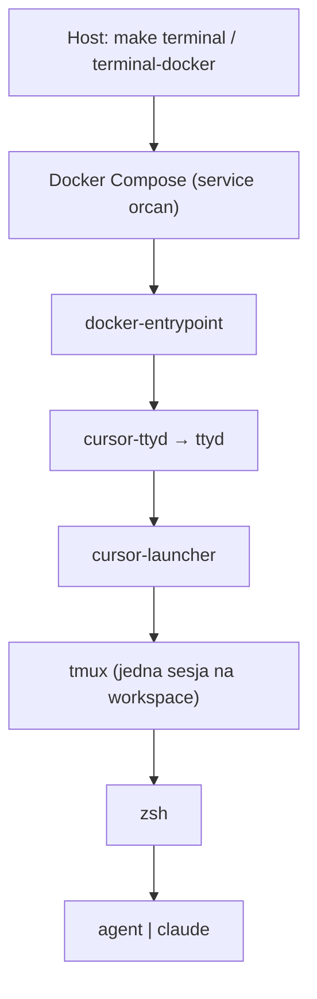

# Architektura

## Czym jest Orcan

**Orcan** to **orkiestrator środowiska i kontekstu**. Decyduje *gdzie* pracujesz i *co* mogą widzieć agenci kodujący.

Cursor CLI (`agent`) i Claude Code (`claude`) to narzędzia wewnątrz tego środowiska. **Modele są poza zakresem** konfiguracji Orcana — każde CLI wybiera własny model.

## Granica produktu

| Orcan odpowiada za | Orcan nie odpowiada za |
| --- | --- |
| Workspaces, mounty, path parity | Który model używa CLI |
| Context pack (ignores, `AGENTS.md` / `CLAUDE.md`) | Prompt engineering pod model |
| Ścieżka wejścia (ttyd → launcher → tmux → zsh) | Auto-routing między CLI |
| Izolacja Dockera i opcjonalny socket hosta | Współdzielony RAG / pamięć poza plikami workspace'a |

```text
orcan.config.json  →  mounts + workspace roots
                   →  context pack
                   →  tmux / launcher
                   →  agent | claude   (their models stay theirs)
```

## Stos runtime



## Jednostka kontekstu = workspace

**Workspace** to jeden root, jedna sesja tmux oraz jeden lub więcej checkoutów projektów. Zobacz [Workspaces](workspaces.md).

### Context pack

`init-workspace` utrzymuje pliki w rootcie workspace'a:

| Plik | Rola | Polityka aktualizacji |
| --- | --- | --- |
| `.manifest.json` | Ścieżki i symlinki | Przy każdym starcie |
| `AGENTS.md` / `CLAUDE.md` | Współdzielone instrukcje agentów | Przy każdym starcie |
| `.cursorignore` / `.cursorindexingignore` / `.claudeignore` | Wykluczenia discovery | Tylko gdy brakuje |
| `.claude/settings.json` | Reguły deny dla sekretów | Tylko gdy brakuje |
| `.orcan/session-brief.md` | Opcjonalny handoff | Na żądanie (`orcan-session-brief`) |

Agenci powinni czytać: **`AGENTS.md` → `.manifest.json` → opcjonalny session brief → pliki projektu**.

Orcan **nie** modyfikuje automatycznie zamontowanych checkoutów git przy każdym starcie. Użyj `make init-project-all`, gdy chcesz seedów w każdym `projects[].path`.

## Host vs obraz

| Obszar | Lokalizacja |
| --- | --- |
| Orkiestracja na hoście | `Makefile`, `scripts/repository/`, pliki Compose |
| System plików kontenera | `docker/rootfs/` |
| Build obrazu | `Dockerfile` |
| Globalne domyślne Cursor (seedowane w runtime) | `docker/rootfs/opt/cursor-defaults/` |
| Reguły Cursor tego repo | `.cursor/rules/` |

## Non-goals

Nie dodawaj do Orcana:

- UI ani flag do wyboru / przypinania modeli
- Abstrakcji `AgentProvider` nad `agent` / `claude`
- Auto-routingu promptów między CLI
- Kolejki zadań (brief → CLI → magistrala wyników)

## Zobacz też

- [Workspaces](workspaces.md)
- [Path parity](path-parity.md)
- [Konfiguracja](../getting-started/configuration.md)
- [Kontekst AI projektu](../ai/project-context.md)
