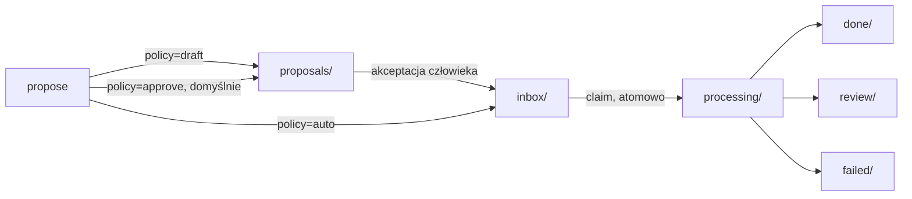

# Skrzynka agentów

**Skrzynka agentów** (agent inbox) to kolejka na plikach pod
`<workspace_root>/.orcan/tasks/`, która przekazuje mały, ustrukturyzowany
**manifest zadania** od agenta planującego/dyskutującego do agenta
wykonującego. Nigdy nie przekazuje własnego transkryptu agenta dyskutującego.

## Problem, który to rozwiązuje

Rozmowa planistyczna w jednej sesji agenta często kończy się „teraz idź to
zaimplementuj". Najprostszy sposób przekazania tego dalej to wklejenie całego
transkryptu do innej sesji — ale to marnuje kontekst na dyskusję, która nigdy
nie była decyzją, i nie daje agentowi wykonującemu żadnego sposobu, żeby
odróżnić „to ustaliliśmy" od „nadal się o to spieraliśmy".

## Jak to działa

Zadanie to plik JSON przechodzący przez ustalony zestaw stanów, powielający
wzorzec propose → review → accept, który już działa w
[Context Assertions](context-assertions.md):



- **`draft`** — zostaje wyłącznie w `proposals/`; nikt nigdy tego nie podejmuje.
- **`approve`** (domyślne) — siedzi w `proposals/`, aż człowiek uruchomi `approve`.
- **`auto`** — trafia od razu do `inbox/`, gotowe do podjęcia natychmiast.

`orcan-inbox` (CLI w kontenerze) pokrywa cały cykl życia:

```bash
orcan-inbox propose --title "Dodaj retry do fetch()" \
  --goal "Wywołania sieciowe powinny ponowić próbę raz po timeoucie" \
  --file src/fetch.ts --acceptance "Istniejące testy nadal przechodzą"
orcan-inbox approve task-abc123
orcan-inbox watch --executor claude   # podejmuje + uruchamia po jednym zadaniu
```

`claim` to atomowa zmiana nazwy (`inbox/<id>.json` → `processing/<id>.json`),
więc dwóch workerów ścigających się o to samo zadanie nigdy obu go nie
dostanie — przegrany po prostu dostaje `OSError` i idzie dalej. **Executor**
zamienia potem manifest w prompt (`build_prompt()` renderuje tylko znane pola:
goal, context, decisions, constraints, files, acceptance, risks — dowolne pole
`transcript` na zadaniu jest po cichu pomijane, nie trafia do promptu) i
uruchamia go — `claude -p`, `codex exec`, albo zwykłe polecenie shell, zależnie
od `execution.executor`.

## Kompromisy

- **Domyślnie wymaga człowieka.** `approve` to domyślna polityka — zadanie
  siedzi w `proposals/`, aż ktoś odpali `approve`. `auto` jest opt-in per
  zadanie.
- **Executor shell to prawdziwe wykonanie polecenia.**
  `execution.executor: shell` uruchamia `execution.command` bezpośrednio. W
  połączeniu z `policy: auto` zadanie jest podjęte i wykonane bez żadnego
  kroku człowieka pomiędzy — to ten sam kompromis granicy zaufania co reszta
  Orcana (zobacz [Bezpieczeństwo](../reference/security.md)), nie
  sandboksowana ewaluacja.
- **Bez podpisu.** Tak jak skrzynka Context Assertions, JSON zadań to zwykłe,
  niepodpisane pliki. Cokolwiek potrafi zapisać do `.orcan/tasks/inbox/`,
  może zakolejkować pracę dla dowolnego watchera, który tam nasłuchuje.
- **Jeden workspace, jedna kolejka.** Nie ma routingu między workspace'ami —
  zadanie zaproponowane w workspace A jest podejmowalne wyłącznie przez
  watcher wskazujący na `.orcan/tasks/` workspace'u A.

## Dalej

- [Bezpieczeństwo](../reference/security.md) — model zaufania i konkretnie
  kombinacja `auto` + `shell`
- [Context Assertions](context-assertions.md) — wzorzec propose/review, który
  jest tu ponownie użyty
- [Model mentalny](mental-model.md)
