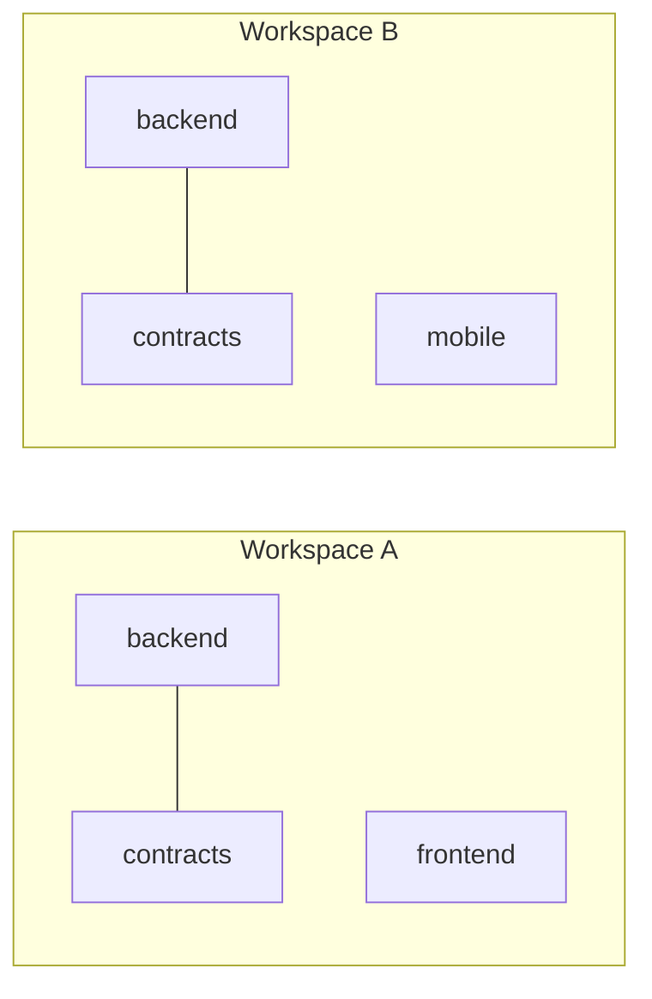
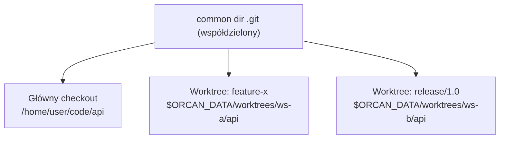
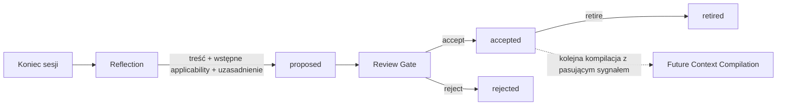

# Context Assertions

**Context Assertion** to niewielkie, zatwierdzone przez człowieka stwierdzenie — reguła, fakt, wskazówka lub polityka — które Context Compiler *może* dołączyć do Context Packa workspace'u, ale tylko wtedy, gdy obowiązuje **właśnie teraz**. Orcan pozostaje Context Managerem: to kolejne źródło, które czyta Compiler, nie system pamięci, nie baza wiedzy, nie RAG.

## Problem, który to rozwiązuje

Te same repozytoria mogą znaczyć co innego w różnych workspace'ach:



`backend` i `contracts` to te same dwa checkouty w obu workspace'ach — ale decyzje, ograniczenia i procedury obowiązujące w Workspace A nie muszą obowiązywać w Workspace B. Model, który zapisuje notatkę „pod projektem `contracts`" i podaje ją każdemu workspace'owi montującemu `contracts`, będzie błędny w połowie przypadków.

Context Assertions naprawiają to, rozdzielając dwie rzeczy, które wyglądają podobnie, ale nie są:

- **Gdzie stwierdzenie jest zapisane** — jego *anchor*, ścieżka projektu, wyłącznie organizacyjna (gdzie rekord fizycznie leży, wersjonowany razem z resztą store'u).
- **Kiedy stwierdzenie obowiązuje** — jego *applicability*, predykat oceniany od nowa dla każdego workspace'u, za każdym razem.

Miejsce przechowywania nigdy nie decyduje o obowiązywaniu. Decyduje wyłącznie predykat.

## Applicability, nie scope

Pojedyncze pole `scope` nie potrafi wyrazić jednocześnie „obowiązuje w workspace A" i „obowiązuje zawsze, gdy `backend` i `contracts` są zamontowane razem, niezależnie od nazwy workspace'u" — realne warunki wymagają składania. Applicability to mały predykat zbudowany z atomów, łączonych zasadą *AND między typami atomów, OR wewnątrz listy jednego atomu*:

| Atom | Odpowiada na pytanie |
| --- | --- |
| `workspace` | Czy workspace nosi jedną z tych nazw? |
| `repo_set_all_of` / `any_of` / `none_of` | Czy te projekty są obecne / nieobecne, razem? |
| `branch` | Czy branch kwalifikującego się projektu pasuje do któregoś z tych wzorców? |
| `valid_from` / `valid_until` | Czy jesteśmy w tym oknie czasowym? |

Brak predykatu oznacza „obowiązuje wszędzie tam, gdzie zamontowany jest projekt-zakotwiczenie tego zapisu" — najczęstszy przypadek nie wymaga żadnej konfiguracji.

Jedno uczciwe ograniczenie: w v1 zapis może być bramkowany tylko przez sygnały znane **przed** startem agenta (nazwa workspace'u, zamontowane repo, branch). To, czego agent faktycznie dotknie, jest znane dopiero *podczas* sesji, więc applicability oparte na ścieżkach jest poza zakresem, dopóki nie pojawi się deklarowany sygnał intencji, względem którego dałoby się je ocenić.

## Tożsamość: co liczy się jako „ten sam projekt"?

Anchor to projekt, ale projekt to nie to samo co ścieżka na dysku. `orcan context worktree create` wypina branch repozytorium pod **własną** ścieżką (`$ORCAN_DATA/worktrees/<workspace>/<project>/`) — inny katalog niż główny checkout, mimo że to niewątpliwie to samo repozytorium.

Gdyby store liczył tożsamość po ścieżce working-copy, worktree brancha po cichu dostawałby pusty store, odcięty od wszystkiego, co już zaakceptowano o tym repo — dokładnie ten sam błąd anchor-jako-scope, przed którym broni się cały ten model, tylko piętro niżej.

Zamiast tego tożsamość jest liczona po git **common dir** (`git rev-parse --git-common-dir`) — bazie obiektów współdzielonej przez wszystkie worktree repozytorium, niezależnie od tego, gdzie każdy z nich akurat jest wypięty:



Wszystkie trzy dają **ten sam** `project_id`, więc ten sam store — branch, na którym akurat jesteś, to nie inny projekt, tylko inna wartość atomu `branch` w Context Signature (patrz tabela wyżej). Napisz zapis „tylko dla release" raz, zakotwiczony w dowolnym z checkoutów, a zadziała poprawnie wszędzie tam, gdzie pojawi się tożsamość tego repo, bramkowany przez branch. Katalog, który w ogóle nie jest repo gita, spada z powrotem na tożsamość-po-ścieżce — stabilną, tylko nieświadomą worktree (projekty w Orcanie i tak mają być repozytoriami git).

## Cykl życia



Nic nie trafia do stanu `accepted` automatycznie. Wymagany jest przegląd człowieka — to tam zwykle naprawia się zbyt szeroki lub zbyt wąski wstępny predykat: recenzent, nie autor propozycji, wie najlepiej, czy coś jest naprawdę specyficzne dla workspace'u, czy strukturalne.

## Propozycja i review bez wychodzenia z sesji

`orcan context assert propose|accept|reject|retire` (CLI hosta) to źródło prawdy, ale pisanie pełnych komend w osobnym terminalu hosta to realne tarcie dla czegoś, co chcesz zrobić w momencie, gdy to zauważysz, w trakcie rozmowy z agentem. Dwa narzędzia wewnątrz kontenera usuwają to tarcie — **bez** przenoszenia decyzji o akceptacji nigdzie poza człowieka:

- **`orcan-context-propose`** — wywoływane przez Ciebie albo przez agenta, w tym samym oknie tmux. Nadal nie dotyka `$ORCAN_DATA/context` (nadal niezamontowany do kontenera) — zapisuje mały plik JSON do `<workspace_root>/.orcan/context-inbox/`. Odpalone interaktywnie, od razu pyta — *„Zapisać na stałe? [t]ak / [e]dytuj zakres / [n]ie"* — i zapisuje Twoją odpowiedź w tym samym pliku. Odpalone nieinteraktywnie (np. przez automatyczny krok Reflection po zadaniu), po prostu kolejkuje kandydata bez decyzji. Ma też drugi tryb dla istniejących zapisów: `--flag-existing ID --reason TEXT` oznacza już zaakceptowany zapis do ponownego rozpatrzenia, bez dotykania store'u — sam nigdy niczego nie zmienia.
- **`orcan-context-review`** — czyta wygenerowany przez hosta `context-review-queue.json` (nigdy surowego store'u) z dwiema sekcjami: `candidates` (nowe, wciąż `proposed`) i `reconsider` (już `accepted` zapisy, które ktoś oflagował). Kandydaci dostają `[t]ak / [n]ie / [s]kip`; zapisy do ponownego rozpatrzenia dostają `[z]achowaj / [w]ycofaj / [s]kip` — „zachowaj" nigdy nie zmienia store'u, tylko czyści flagę. Twoje odpowiedzi stają się plikami decyzji w `<workspace_root>/.orcan/context-decisions/`.

Oba kierunki to jednostronne zrzuty do zamontowanej skrzynki — nie ma żywego kanału z powrotem do hosta. To `orcan sync` (`compile_context.py`) faktycznie zamienia zrzut w prawdziwe, wersjonowane gitem wywołanie `propose()`/`accept()`/`reject()`/`retire()`, przy najbliższym uruchomieniu. W praktyce oznacza to, że decyzja czuje się natychmiastowa w rozmowie, ale realnie trafia do store'u — a więc i do przyszłego `CONTEXT-ASSERTIONS.md` — dopiero przy najbliższym sync'u. Ta asymetria jest celowa: to ta sama granica, która chroni przed bezpośrednim zapisem agenta do store'u, tylko na tyle wygodna, że przejrzenie kandydata kosztuje jedno naciśnięcie klawisza, nie przełączenie kontekstu.

## Wsadowa, zautomatyzowana Reflection

Reflection nie musi być wyzwalana przez człowieka, który coś zauważy — ale wywoływanie modelu po *każdej pojedynczej* turze byłoby i marnotrawne, i hałaśliwe. `orcan-context-reflect` batchuje zamiast tego: jest podpięty jako **opcjonalny** hook `Stop` w Claude Code (szablon: `docker/rootfs/opt/cursor-defaults/templates/claude/hooks.example.json` — skopiuj go do `.claude/settings.json` workspace'u albo swojego globalnego, żeby go włączyć; Orcan nigdy nie robi tego sam). Hook odpala się po każdej zakończonej turze, ale przy większości z nich nie robi prawie nic:

- Licznik per `session_id` oraz offset w transkrypcie żyją w `<workspace_root>/.orcan/reflection-state.json`. Śledzenie jest kluczowane po id sesji, bo offset z transkryptu jednej sesji nic nie znaczy dla innej.
- Poniżej progu (domyślnie 20 zakończonych tur) hook tylko inkrementuje licznik i kończy działanie — zero wywołania modelu, koszt bliski zeru.
- Przy progu resetuje licznik, czyta tylko *nowe* linie transkryptu od ostatniego razu, czyta aktualny `CONTEXT-ASSERTIONS.md` workspace'u (dokładnie to, co i tak widzi agent — bez dodatkowego okrążenia przez hosta), i prosi lekki model (domyślnie `claude -p --model haiku`) o zwrócenie krótkiej listy akcji w JSON: `propose` dla nowych kandydatów, `flag_existing` dla zapisów, które teraz wyglądają na nieaktualne. Każda akcja jest dyspatchowana przez ten sam `orcan-context-propose` co przy ręcznym szkicowaniu — zawsze `--queue`, nigdy z dołączoną decyzją, więc człowiek i tak to przegląda.
- Zawsze działa też ręczny zawór bezpieczeństwa: odpal `orcan-context-reflect --force` (podając ten sam session id/ścieżkę transkryptu/cwd), żeby zrobić refleksję natychmiast, niezależnie od licznika — przydatne, bo sesja, która kończy się przed osiągnięciem progu, inaczej nigdy by go nie wyzwoliła automatycznie.

Sprawdzenie progu dzieje się całkowicie przed wywołaniem jakiegokolwiek modelu, więc większość zdarzeń `Stop` kosztuje kilka milisekund operacji na plikach i nic więcej. I — warto to powtórzyć, bo to jedyna zasada, z której ta architektura nigdy nie schodzi — przebieg refleksji może *zaproponować* i może *oflagować*, ale nigdy sam nie może niczego zaakceptować, odrzucić ani wycofać.

To też oznacza, że **zautomatyzowany krok Reflection jest w pełni zgodny z tym modelem**: coś odpalane po każdym zadaniu może porównać sesję z już zaakceptowanymi zapisami, ocenić co jest naprawdę nowe, i wywołać `orcan-context-propose --queue` dla wszystkiego, co warto pokazać — zero ręcznej pracy do tego momentu. Jedyne, czego nigdy nie może zrobić samo, to dołączyć decyzję — tylko człowiek odpowiadający w `orcan-context-review` (albo w interaktywnym pytaniu propose) może zamienić kandydata w obowiązującą prawdę. Usunięcie tego jednego punktu kontrolnego wraca dokładnie do błędu, przed którym broni się cała ta architektura: nieporozumienie z jednej sesji kompilujące się w „ustalony fakt" następnej, bez żadnego kroku korygującego pomiędzy.

## Kompilacja: artefakt, nie dokument

`orcan sync` uruchamia **Applicability Layer** dla każdego aktywnego workspace'u: buduje **Context Signature** (nazwa workspace'u, faktycznie zamontowane repo, aktualny branch każdego z nich) i dopasowuje ją do każdego zaakceptowanego (`accepted`) zapisu zakotwiczonego w projekcie należącym do tego workspace'u. Dopasowania trafiają do wygenerowanego `CONTEXT-ASSERTIONS.md` w katalogu głównym workspace'u — widocznego obok `AGENTS.md`/`CLAUDE.md` w reszcie context packa, ale tylko wtedy, gdy coś faktycznie pasowało (bez wiszącego pustego pliku w przeciwnym razie).

Każdy wyrenderowany element niesie dwa odrębne uzasadnienia:

- **Jaki problem rozwiązuje** — powód autora, dla którego zapis w ogóle istnieje.
- **Dlaczego wybrany** — mechaniczny powód, dla którego dopasował się do *tego* sygnału (np. `workspace=customer-a`).

Jeśli Compiler nie potrafi podać obu, element nie trafia do packa. Dlatego Context Pack jest artefaktem kompilacji ze ścieżką audytu, nie rosnącym stosem notatek — i dlatego istnieje twardy limit liczby zapisów w jednej kompilacji, wymuszający priorytetyzację zamiast akumulacji.

## Bez bazy danych — zwykłe pliki, wersjonowane gitem

Nie ma tu SQLite, vector store'a ani serwera. Każdy anchor projektu to jeden katalog:

```
$ORCAN_DATA/context/<project-id>/
├── .git/            ← historia = wersjonowanie (każda zmiana to commit)
├── index.json        ← płaski indeks (id → title/status/kind/daty) do szybkiego list/select
└── objects/
    ├── <id-1>.json    ← jeden pełny rekord Context Assertion
    └── <id-2>.json
```

To cała „baza danych". To świadome ograniczenie MVP, nie tymczasowy substytut docelowej: pliki + git + prosty indeks, żeby cały mechanizm dało się prześledzić `cat`-em i `git log`-iem, a każda przyszła zmiana sposobu przechowywania będzie szczegółem implementacyjnym pod tymi samymi funkcjami, nie przeprojektowaniem.

## Czego świadomie nie robi

- Brak embeddingów, wyszukiwania wektorowego czy rankingu przez LLM — dopasowanie to kilka mechanicznych sprawdzeń predykatu.
- Brak automatycznej akceptacji — propozycja (nawet z automatycznego, wsadowego przebiegu Reflection) nigdy nie oznacza zastosowania; tylko decyzja człowieka, natychmiastowa albo odroczona, może zmienić kandydata w `accepted`, zachować coś, albo to wycofać.
- Brak rekompilacji na żywo — szkicowanie i decydowanie może dziać się w locie, w trakcie sesji, ale Applicability Layer i Context Pack, który tworzy, odświeżają się tylko przy najbliższym `orcan sync`; trwająca sesja nie może tego wywołać.
- Brak automatycznego rozwiązywania konfliktów między zapisami — v1 polega na tym, że każdy dopasowany element jest renderowany razem z innymi, widocznie, tak by człowiek lub agent mógł zauważyć sprzeczność.
- Brak samodzielnego wycofywania — automatyczny przebieg Reflection może *oflagować* zapis jako potencjalnie nieaktualny, ale jego wycofanie to zawsze ludzkie `[w]ycofaj` w `orcan-context-review`, nigdy automat.

## Status: zaimplementowane vs. proponowane

**Zaimplementowane (RFC-0001) — w kodzie dziś:**

- Rekord Context Assertion: treść, `kind` (wyłącznie prezentacyjny: rule/fact/hint/policy/…), `justification`, predykat `applicability`, status cyklu życia.
- Store: `scripts/repository/context_assertions.py` — propose / accept / reject / retire, wersjonowany gitem per anchor pod `$ORCAN_DATA/context/<project-id>/`.
- Tożsamość liczona po git common-dir, więc główny checkout repo i jego worktree współdzielą jeden store (patrz „Tożsamość" wyżej).
- Applicability Layer: `select_for_workspace()` — dopasowuje `workspace` / `repo_set_*` / `branch` / `valid_from`-`valid_until` do Context Signature zbudowanej z `runtime-config.json` + `git branch --show-current`.
- Hook Compilera: `scripts/repository/compile_context.py`, uruchamiany przez `orcan sync`, renderuje `CONTEXT-ASSERTIONS.md` w katalogu workspace'u; `docker/rootfs/usr/local/bin/init-workspace` pokazuje go z wygenerowanego `AGENTS.md`/`CLAUDE.md`, gdy istnieje.
- CLI: `orcan context assert propose|list|show|accept|reject|retire|select|root` (host).
- Skrzynka wewnątrz kontenera: `orcan-context-propose` / `orcan-context-review` zrzucają pliki JSON do `<workspace_root>/.orcan/context-inbox/` i `context-decisions/`; `compile_context.py` importuje je (kwarantanna dla wszystkiego uszkodzonego lub nierozwiązywalnego) i regeneruje `context-review-queue.json` przy każdym `orcan sync`, przed kompilacją. Patrz „Propozycja i review bez wychodzenia z sesji" wyżej.
- Ponowne rozpatrzenie: `orcan-context-propose --flag-existing ID --reason TEXT` oznacza już zaakceptowany zapis do drugiego spojrzenia, śledzone w `<workspace_root>/.orcan/context-flags/`; `orcan-context-review` oferuje `[z]achowaj`/`[w]ycofaj`.
- Wsadowa, zautomatyzowana Reflection: `orcan-context-reflect`, opcjonalny hook `Stop`, który batchuje po liczniku tur per sesja (domyślnie 20) zanim wywoła lekki model i zdyspatchuje przez ten sam narzędzie propose. Patrz „Wsadowa, zautomatyzowana Reflection" wyżej.

**Zaimplementowane (RFC-0002 — rozszerzenie rekordu, nie nowy podsystem):**

Pytanie za RFC-0002 brzmiało, czy Orcan potrzebuje osobnego, samopogłębiającego się systemu „rozumienia" ponad RFC-0001. Werdykt: nie — to wymagałoby, żeby system sam interpretował i wnioskował, czyli dokładnie tego reasoningu, którego Orcan nie może robić. Zaakceptowany kierunek to małe, zdyscyplinowane *rozszerzenie* istniejącego rekordu Context Assertion — dziś już zaimplementowane:

- **Typowane relacje** — `relations: [{type, target_id, target_project}]` na rekordzie (`normalize_relations()` w `context_assertions.py`), mały, zamknięty słownik: `depends_on`, `risk_of`, `supersedes`, `conflicts_with`. Swobodny tekst „related to" był jawnie odrzucony — otwarty słownik to z powrotem notatnik. Relacja zawsze leży na zapisie *źródłowym* i jest walidowana względem istniejącego celu przy propose/accept — nigdy nie zmienia celu.
- **Status epistemiczny** — `epistemic_status: fact | interpretation | hypothesis | conclusion` (domyślnie `fact`), nadawany przy propose i poprawialny wyłącznie przez człowieka przy Review (`accept(..., edited_epistemic_status=...)`), nigdy autorytatywnie wywnioskowany przez system. Samo „zrozumienie" nadal nie jest przechowywanym poziomem — to jest to, co robi człowiek (albo agent), czytając dobrze oznaczony, powiązany zestaw powyższych; zadaniem store'u jest tylko to ułatwić.
- **`criticality`** — `normal` / `high`, ten sam wzorzec: proponowane, poprawialne przez człowieka przy accept.
- **Ograniczony traversal 1-hop** — `select_for_workspace()` dociąga zaakceptowany cel relacji po normalnym dopasowaniu applicability, ale tylko gdy projekt celu jest zamontowany w *tym* workspace, tylko jeśli jeszcze nie wybrany, i nigdy ponad ten sam łączny `limit`. Bez rekurencji — relacje celu nigdy nie są śledzone o kolejny hop.
- Reflection też potrafi to wszystko szkicować: model może zasugerować `epistemic_status`, `criticality` i `relations` w akcji `propose` — zawsze odnosząc się do id już widocznego w bieżącym `CONTEXT-ASSERTIONS.md`, zawsze w obrębie tego samego projektu (automatyczny Reflection nigdy nie zgaduje nazwy innego projektu; relacje między projektami nadal działają ze ścieżki interaktywnej/hosta, gdzie nazwa projektu jest podana wprost). Człowiek nadal poprawia albo zatwierdza każde pole, zanim cokolwiek stanie się `accepted`.

Nic z tego nie wymagało nowego store'u, nowego CLI ani nowej lokalizacji plików — to dodatkowe pola na tych samych rekordach, w tych samych plikach, udostępnione przez ten sam przepływ propose/review.

## Dalej

- [CLI reference](../reference/cli.md) — `orcan context assert propose|list|show|accept|reject|retire|select`
- [Core Ideas](core-ideas.md) — Project, Workspace, Context
- [Model mentalny](mental-model.md)
