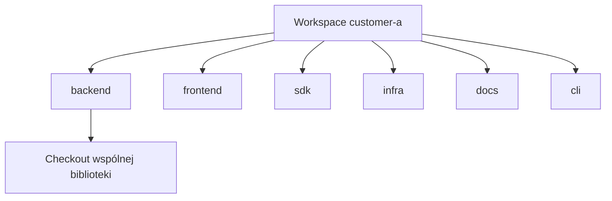

# Idee podstawowe

Trzy słowa niosą większość Orcana. Poznaj je przed jakimkolwiek targetem Make.

## Project

**Project** to jeden checkout repozytorium na dysku: ścieżka bezwzględna, którą i tak klonujesz Gitem.

To nie „firma”, nie „produkt” i nie cała praca. To jedno drzewo kodu z własną historią i remote'ami.

Dlaczego to nazywać? Bo agenci i ludzie często mylą „pracę” z „tym folderem”. W Orcanie folder to **project**. Praca obejmująca kilka folderów to coś innego.

## Workspace

**Workspace** to **nazwany zbiór projektów**, które należą do siebie na odcinek pracy.

Grupuje:

- które checkouty stoją obok siebie
- jedno miejsce na wspólne pliki dla agentów (context pack)
- jedną sesję interaktywną (tmux), więc „przełącz klienta” = przełącz workspace

Workspace jest ważniejszy niż pojedynczy projekt, gdy używasz agentów kodujących: agent potrzebuje **wiązki**, nie tylko repo aplikacji.

Bez workspace'ów wciąż wymyślasz „te sześć ścieżek to customer A”.

## Context

**Context** to to, co Ty i agenci widzicie i na czym polega ten workspace:

- zamontowane drzewa (te same ścieżki bezwzględne co na hoście — path parity)
- krótkie linki nawigacyjne w rootcie workspace'a
- wspólne instrukcje i ignores (`AGENTS.md`, `CLAUDE.md`, pliki ignore)
- opcjonalne notatki handoff

Context to nie baza wektorowa i nie biblioteka promptów modelu. To **odtwarzalne środowisko pracy** wokół kilku projektów.

### Przykład: Customer A

Wyobraź workspace o nazwie `customer-a`:

| Symlink projektu | Checkout (ścieżka bezwzględna) | Typowa org |
| --- | --- | --- |
| `backend` | `/home/you/code/acme-api` | Zespół API Acme |
| `frontend` | `/home/you/code/acme-web` | Web Acme |
| `sdk` | `/home/you/code/partner-sdk` | Partner |
| `infra` | `/home/you/code/acme-infra` | Platforma |
| `docs` | `/home/you/code/acme-handbook` | Docs |
| `cli` | `/home/you/code/acme-cli` | Narzędzia |

Sześć remote'ów. Sześć historii. **Jeden kontekst.**



Diagram dotyczy **przynależności**, nie remote'ów Gita. Workspace nie „zawiera” commitów; **nazywa zbiór**, w którym pracujecie razem.

### Przykład: sam Orcan

Mały workspace może montować tylko repo Orcana — przydatne przy rozwoju orkiestratora. Te same idee: jedna ścieżka projektu, jedna nazwa workspace'a, jeden context pack.

## Jak idee się łączą

```text
Context (w czym pracujesz)
    └── Workspace (nazwana wiązka + sesja)
            ├── Project (ścieżka repo)
            ├── Project
            └── Project
```

Git zarządza każdym projektem. Orcan zarządza tym, jak tworzą kontekst.

## Dalej

- [Model mentalny](mental-model.md) — relacje i kształt konfiguracji  
- [Workspaces (głębiej)](../concepts/workspaces.md)  
- [Dlaczego Orcan?](../why-orcan.md)
