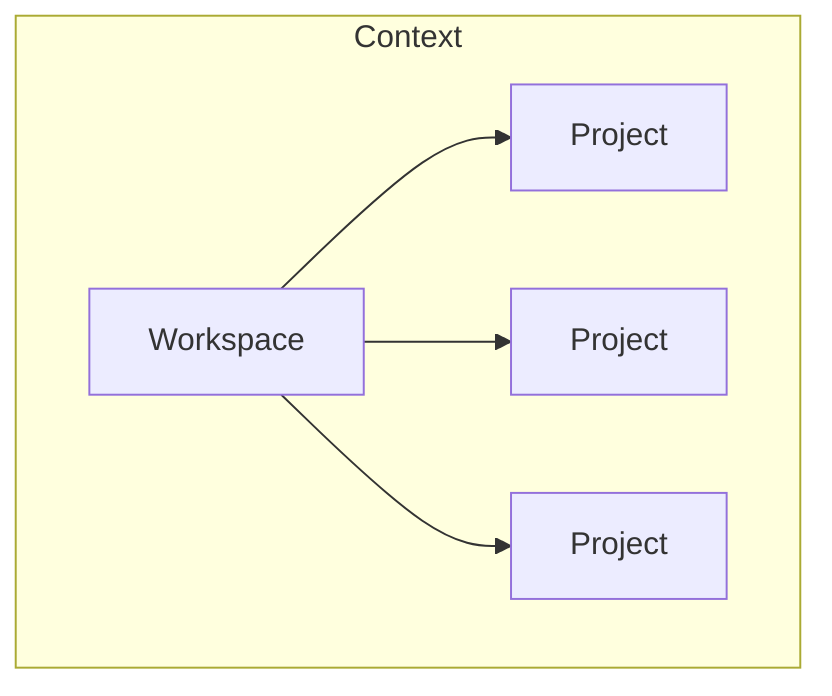
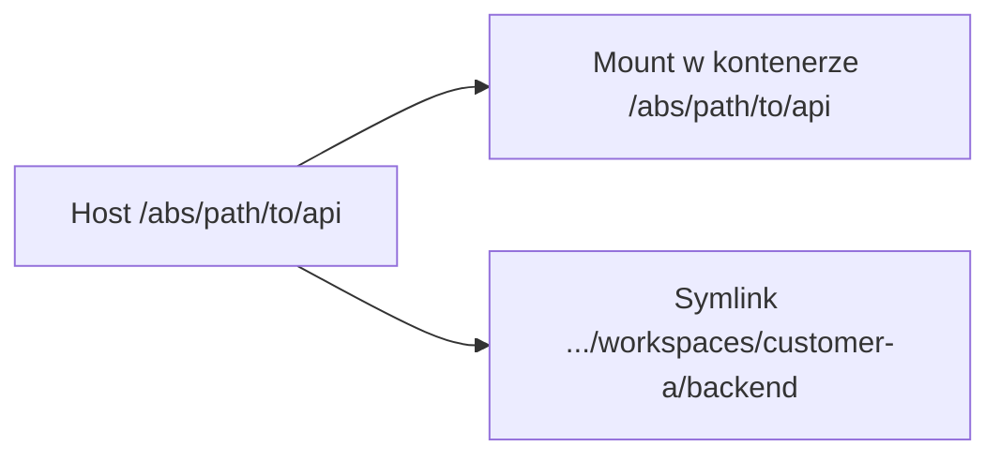
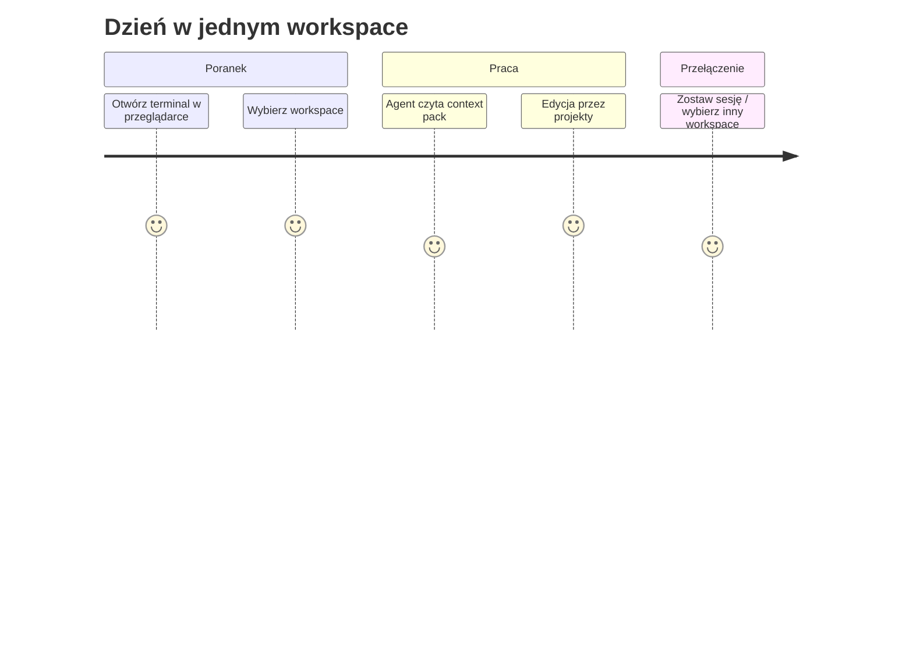

# Model mentalny

Trzymaj ten obraz, zanim dotkniesz JSON-a lub Make.

## Drzewo

```text
Workspace
    │
    ├── Project
    ├── Project
    ├── Project
    └── Project
```



**Podpis:** Workspace siedzi w kontekście. Projekty wiszą na workspace jako członkowie, nie jako zagnieżdżone remote'y git.

## Trzy zdania

1. **Workspace** nie trzyma historii źródeł. Opisuje **które projekty należą do siebie** i jak wchodzisz do tego zbioru (sesja, pliki startowe).
2. **Project** nie opisuje biznesu. Opisuje **jedną ścieżkę repozytorium** na dysku.
3. **Context** opisuje **środowisko pracy**: mounty, wspólne instrukcje, ignores oraz ścieżkę wejścia do terminala.

## Co konfigurujesz

Gdy idee są jasne, plik hosta to tylko opis drzewa:

```json
{
  "workspaces": [
    {
      "name": "customer-a",
      "projects": [
        { "name": "backend", "path": "/absolute/path/to/acme-api" },
        { "name": "frontend", "path": "/absolute/path/to/acme-web" },
        { "name": "sdk", "path": "/absolute/path/to/partner-sdk" }
      ]
    }
  ]
}
```

- `workspaces[].name` — tożsamość workspace'a (i nazwa sesji tmux).
- `projects[].name` — krótka nazwa w workspace (symlink).
- `projects[].path` — bezwzględna ścieżka hosta (ta sama w kontenerze).

Pełna lista pól: [Przewodnik po konfiguracji](../getting-started/configuration.md).

## Dwa sposoby widzenia tych samych projektów

Orcan pokazuje każdy projekt na dwa komplementarne sposoby:

| Widok | Rola |
| --- | --- |
| Symlink pod `/home/developer/workspaces/<name>/` | Nawigacja człowieka i agenta („cd backend”) |
| Bind mount pod **tą samą ścieżką bezwzględną** co host | Path parity dla Docker-from-Docker |

To nie duplikacja dla sztuki. Zagnieżdżony Compose na daemonie **hosta** rozumie tylko ścieżki hosta. Same symlinki okłamałyby Dockera. Same mounty abs byłyby niewygodne w przeglądaniu. Dostajesz oba.



**Podpis:** Ten sam checkout, dwie ścieżki dostępu — parity dla Dockera, krótkie nazwy dla ludzi i agentów.

## Podróż dnia (mentalna, nie komendy)



**Podpis:** Jednostką „gdzie pracuję?” jest workspace, nie pojedyncze `cd` do jednego repo.

## Path parity jako konsekwencja

Path parity nie jest przypadkową funkcją. Wynika z tego, że „agenci mogą odpalać Dockera wobec daemona hosta”. Zobacz [Path parity](../concepts/path-parity.md).

## Dalej

- [Architektura](../architecture.md) — dlaczego warstwy wyglądają tak  
- [Szybki start](../getting-started/quickstart.md)  
- [Typowe workflowy](../guides/workflows.md)
