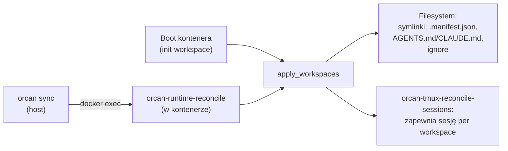

# Runtime reconcile

Dodanie projektu do workspace'u albo jego usunięcie kiedyś oznaczało `orcan
down && orcan up` — świeży kontener, świeży serwer tmux, i cokolwiek agent
akurat robił — zniknięte. **Runtime reconcile** to mechanizm, dzięki któremu
samo `orcan sync` wystarcza w typowym przypadku.

## Problem, który to rozwiązuje

Rekreacja kontenera nie jest darmowa. Zabija każdą sesję tmux, więc agent w
trakcie zadania traci stan powłoki, uruchomiony proces i — jeśli akurat nie
patrzyłeś — swoją pracę. Potrzeba rekreacji tylko po to, żeby nowo dodane
repo stało się widoczne, to zły kompromis dla czegoś, co powinno kosztować
tyle co edycja pliku configu.

## Dwie rzeczy zostają stabilne, więc rekreacja nie jest potrzebna

- **Jeden mount managed-root.** Każdy projekt pod `$ORCAN_PROJECTS_ROOT`
  (domyślnie `sandbox/`) jest już widoczny w kontenerze przez jeden, zawsze
  obecny mount — zobacz [Model mentalny](mental-model.md) ("Sandbox jako
  stabilna kotwica"). Dodanie projektu pod tym korzeniem nigdy nie zmienia
  listy mountów Compose.
- **Jeden mount rodzica workspace'ów.** `$ORCAN_HOME/workspaces/` jest
  zamontowany raz; nowy katalog workspace'u pod nim jest widoczny od razu —
  zobacz [Model mentalny](mental-model.md) ("Widoczność między workspace'ami").

Reconcile zamienia "widoczne na dysku" w "istnieją właściwe symlinki,
manifesty i sesje tmux".

## Co reconcile faktycznie robi

Ta sama funkcja, `orcan.reconcile.apply_workspaces()`, działa w dwóch
miejscach:



Boot kontenera to po prostu pierwszy reconcile, nie osobna ścieżka kodu —
dlatego live `orcan sync` i świeży boot dają identyczny stan na dysku.

Po stronie filesystemu: tworzy brakujące symlinki projektów, usuwa
osierocone, (ponownie) zapisuje `.manifest.json` / `AGENTS.md` / `CLAUDE.md`
/ `README.workspace.md` — ale tylko gdy treść faktycznie się zmieniła, więc
niezmieniony workspace nie kosztuje żadnych zapisów przy reconcile, które nic
nie znajduje.

Po stronie tmux: zapewnia, że każdy skonfigurowany workspace ma sesję
(tworzoną leniwie, bez attach). Sesja, której workspace zniknął z configu,
jest **raportowana, nigdy nie zabijana** domyślnie — aktywny agent w środku
nie może stracić sesji tylko dlatego, że jego workspace zmienił nazwę albo
został usunięty. `orcan sync --prune-orphans` daje opt-in na zabijanie takich
(nigdy domyślnie).

`orcan-runtime-status` daje tylko-do-odczytu diff — pożądany (config) vs
faktyczny (filesystem + tmux) — bez niczego reconcile'owania, przydatne tuż
przed albo po live-zmianie.

## Przykład

```bash
# Workspace "demo" działa; dodajesz do niego drugi projekt.
orcan context add /absolutna/sciezka/do/innego-repo --workspace demo
orcan sync
# container is running — reconciling live (no restart)
# live reconcile complete
```

Symlink nowego projektu pojawia się pod
`/home/developer/workspaces/demo/` w *działającym* kontenerze. Żadna otwarta
sesja tmux — łącznie z tą, w której agent jest w trakcie zadania — nie jest
ruszana.

## Kompromisy

- **Tylko dwa stabilne mounty pomijają rekreację.** Projekt spoza
  `$ORCAN_PROJECTS_ROOT` nadal potrzebuje własnego bindu path-parity —
  dodanie takiego nadal wymaga `orcan down && orcan up`.
- **Sprzątanie osieroconych sesji tmux jest opt-in, celowo.** Domyślny
  tryb tylko-raport kosztuje Cię linijkę `? nazwa-sesji` w
  `orcan-runtime-status`, dopóki jawnie nie odpalisz prune'a; alternatywa
  (auto-kill) ryzykuje zabicie sesji, z której aktywnie korzysta agent.
- **Idempotentne, nie darmowe.** Reconcile bez zmian nadal przechodzi każdy
  skonfigurowany workspace i porównuje jego cztery generowane pliki z
  dyskiem — tanie, ale nie dosłownie zerowy koszt przy bardzo dużym configu.

## Dalej

- [Referencja CLI](../reference/cli.md) — `orcan sync [--prune-orphans]`
- [Model mentalny](mental-model.md) — dlaczego mounty sandboxa i workspace'ów są stabilne
- [Bezpieczeństwo](../reference/security.md) — kompromisy layoutu mountów
