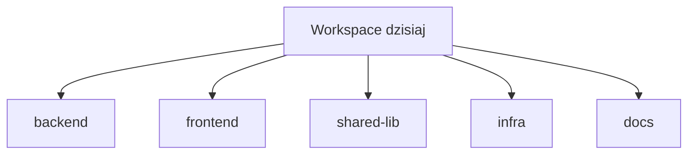

# Orcan

Orcan orkiestruje **kontekst pracy** dla agentów kodujących: które repozytoria należą do siebie, jak są montowane i jak wchodzisz do tego środowiska w Dockerze.

**Nie** wybiera modeli. Cursor CLI (`agent`) i Claude Code (`claude`) zachowują własne konta i ustawienia modeli.

## Problem

Utrzymujesz wiele repozytoriów. Często pochodzą z różnych organizacji. Niektóre współpracują. Niektóre przypinają wersje wspólnych bibliotek. Każdy laptop zbiera inny zestaw narzędzi i nawyków startu.

Po kilku miesiącach kosztowna nie jest komenda `git clone`. Kosztowne jest **odtworzenie pełnego kontekstu**: które checkouty tworzą dzisiejszą pracę, co agenci powinni przeczytać najpierw i które ścieżki bezwzględne nadal działają, gdy Docker uruchamia Dockera.

## Rozwiązanie

Orcan nie zarządza produktami. Zarządza **kontekstem**.

- **Project** to jeden checkout (ścieżka bezwzględna).
- **Workspace** to nazwany zbiór projektów, które należą do siebie.
- **Context** to odtwarzalne środowisko wokół tego zbioru: mounty, wspólne instrukcje, ignores oraz sesja terminala w przeglądarce.

Konfiguracja opisuje te relacje. `orcan sync` i Docker je stosują. Agenci i ludzie dzielą ten sam układ.

## Dzień pracy

Rano możesz jednocześnie tknąć:

- backend API  
- frontend  
- wspólną bibliotekę  
- infrastrukturę  
- dokumentację  

Każde to osobne repozytorium. Każde może żyć pod inną organizacją. Razem to nadal **jedna praca**. Orcan pozwala nazwać tę pracę jako workspace i otworzyć ją jako jedną sesję.



**Podpis:** Jeden workspace, wiele projektów — jednostką pracy jest zbiór, nie pojedynczy folder.

## Jak czytać te docs

1. [Dlaczego Orcan?](why-orcan.md) — kiedy pomaga, a kiedy nie  
2. [Idee podstawowe](ideas/core-ideas.md) — Project, Workspace, Context  
3. [Model mentalny](ideas/mental-model.md) — jak elementy się łączą  
4. [Szybki start](getting-started/quickstart.md) — uruchom, gdy rozumiesz ideę  

Strony referencyjne (CLI, zmienne, Compose) są **po** tym łuku.

## Spróbuj (po idei)

```bash
git clone https://github.com/aKyther/orcan.git
cd orcan
orcan init /absolute/path/to/your/repo   # zawiera orcan sync raz
orcan sync                                             # .env + mounts/* dla Compose
orcan build
orcan up
```

Otwórz `http://localhost:7681`, wybierz workspace, potem uruchom `agent` lub `claude`. Po zmianach konfiguracji zawsze `orcan sync` przed odtworzeniem.

## Status

Wersja **0.4.2** (zobacz [Changelog](changelog.md)). Dystrybucja jako **CLI** (`orcan`). `orcan build` pobiera obraz dla tej wersji, gdy jest dostępny, w przeciwnym razie buduje lokalnie. Publikacja obrazów jest **ręczna** (`orcan publish`); CI nie publikuje obrazów kontenerów.

## Zobacz też

- [Architektura](architecture.md)  
- [FAQ](faq.md)  
- [Repozytorium na GitHubie](https://github.com/aKyther/orcan)
